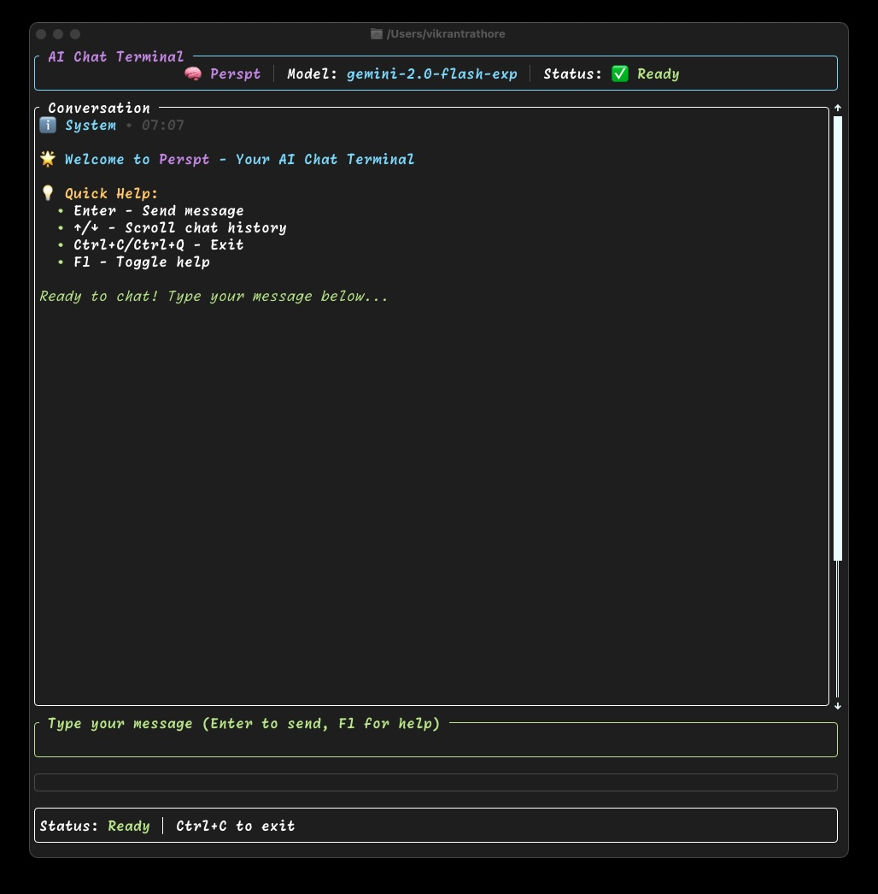

# 👁️ Perspt: Your Terminal's Window to the AI World 🤖

> "The keyboard hums, the screen aglow,\
>  AI's wisdom, a steady flow.\
>  Will robots take over, it's quite the fright,\
>  Or just provide insights, day and night?\
>  We ponder and chat, with code as our guide,\
>  Is AI our helper or our human pride?"

**Perspt** (pronounced "perspect," short for **Per**sonal **S**pectrum **P**ertaining **T**houghts) is a high-performance command-line interface (CLI) application that gives you a peek into the mind of Large Language Models (LLMs). Built with Rust for speed and reliability, it allows you to chat with various AI models from multiple providers directly in your terminal using the modern **genai** crate's unified API.

[](https://github.com/user-attachments/assets/f80f7109-1615-487b-b2a8-b76e16ebf6a7)

## 🎯 Why Perspt?

- **🚀 Latest Model Support**: Built on the modern `genai` crate with support for state-of-the-art models like **OpenAI GPT-5.2**, **Google Gemini 3**, and **Anthropic Claude Opus 4.5**
- **⚡ Real-time Streaming**: Ultra-responsive streaming responses with proper reasoning chunk handling
- **🛡️ Rock-solid Reliability**: Comprehensive panic recovery and error handling that keeps your terminal safe
- **🎨 Beautiful Interface**: Modern terminal UI with markdown rendering and smooth animations
- **🤖 Zero-Config Startup**: Automatic provider detection from environment variables - just set your API key and go!
- **🔧 Flexible Configuration**: CLI arguments, environment variables, and JSON config files all work seamlessly

## ✨ Features

- **🤖 SRBN Agent Mode:** NEW! Autonomous coding assistant using Stabilized Recursive Barrier Networks - decomposes tasks, generates code, verifies via LSP, and self-corrects errors.
- **🎨 Interactive Chat Interface:** A colorful and responsive chat interface powered by Ratatui with smooth scrolling and custom markdown rendering.
- **🖥️ Simple CLI Mode:** Minimal command-line mode for direct Q&A without TUI overlay - perfect for scripting, accessibility, or Unix-style workflows.
- **⚡ Advanced Streaming:** Real-time streaming of LLM responses with support for reasoning chunks and proper event handling.
- **🔬 LSP Integration:** Built-in Language Server Protocol client using `ty` for Python - provides real-time type checking and error detection.
- **🧪 Test Runner:** Integrated pytest runner with V_log (Logic Energy) calculation from weighted test failures.
- **🤖 Automatic Provider Detection:** Zero-config startup that detects and uses available providers based on environment variables.
- **🔀 Latest Provider Support**: Built on the modern `genai` crate with support for cutting-edge models.
- **📊 Token Budget Tracking:** Tracks input/output tokens and cost estimation with configurable limits.
- **🔧 Retry Policy:** PSP-4 compliant retry limits (3 for compilation, 5 for tools) with automatic escalation.
- **💾 Conversation Export:** Save your chat conversations to text files using the `/save` command.
- **📜 Custom Markdown Parser:** Built-in markdown parser optimized for terminal rendering.
- **🛡️ Graceful Error Handling:** Robust handling of network issues, API errors, and edge cases.

## 🚀 Getting Started

### 🤖 Zero-Config Automatic Provider Detection

Perspt features intelligent automatic provider detection. Simply set an environment variable for any supported provider, and Perspt will automatically detect and use it!

**Priority Detection Order:**
1. OpenAI (`OPENAI_API_KEY`)
2. Anthropic (`ANTHROPIC_API_KEY`) 
3. Google Gemini (`GEMINI_API_KEY`)
4. Groq (`GROQ_API_KEY`)
5. Cohere (`COHERE_API_KEY`)
6. XAI (`XAI_API_KEY`)
7. DeepSeek (`DEEPSEEK_API_KEY`)
8. Ollama (no API key needed - auto-detected if running)

**Quick Start:**

```bash
# Set your API key
export OPENAI_API_KEY="sk-your-openai-key"

# That's it! Start chatting
./target/release/perspt
```

### 📚 Documentation

**Read the [perspt book](docs/perspt.pdf)** - This illustrated guide walks through the project and explains key concepts.

### 🛠️ Prerequisites

- **Rust:** Ensure you have the Rust toolchain installed. Get it from [rustup.rs](https://rustup.rs/).
- **🔑 LLM API Key:** For cloud providers, you'll need an API key:
  - **OpenAI**: [platform.openai.com](https://platform.openai.com) (supports GPT-5.2, o3-mini, o1-preview)
  - **Anthropic**: [console.anthropic.com](https://console.anthropic.com) (supports Claude Opus 4.5)
  - **Google Gemini**: [aistudio.google.com](https://aistudio.google.com) (supports Gemini 3 Flash/Pro)
  - **Groq**: [console.groq.com](https://console.groq.com)
  - **Cohere**: [dashboard.cohere.com](https://dashboard.cohere.com)
  - **XAI**: [console.x.ai](https://console.x.ai)
  - **DeepSeek**: [platform.deepseek.com](https://platform.deepseek.com)
  - **Ollama**: [ollama.ai](https://ollama.ai) (no API key needed - local models)

### 📦 Installation

```bash
# Clone the repository
git clone https://github.com/eonseed/perspt.git
cd perspt

# Build the project
cargo build --release

# Run Perspt
./target/release/perspt
```

### ⚙️ Configuration

Perspt can be configured using environment variables, a `config.json` file, or command-line arguments.

**Environment Variables (Recommended):**
```bash
export OPENAI_API_KEY="sk-your-key"
./target/release/perspt
```

**Config File (`config.json`):**
```json
{
  "provider_type": "openai",
  "default_model": "gpt-5.2",
  "api_key": "sk-your-api-key"
}
```

**CLI Arguments:**
```bash
perspt --provider-type anthropic --model claude-opus-4.5
perspt --list-models  # List available models
```

### ⌨️ Command-Line Options

| Option | Description |
|--------|-------------|
| `-c, --config <FILE>` | Path to configuration file |
| `-p, --provider-type <TYPE>` | Provider: openai, anthropic, gemini, groq, cohere, xai, deepseek, ollama |
| `-k, --api-key <KEY>` | API key for the provider |
| `-m, --model <MODEL>` | Model name (e.g., gpt-5.2, claude-opus-4.5) |
| `--provider <PROFILE>` | Provider profile from config |
| `-l, --list-models` | List available models |
| `--simple-cli` | Use simple CLI mode (no TUI) |
| `--log-file <FILE>` | Log session to file (simple-cli only) |

## 🤖 Agent Mode - Autonomous Coding Assistant (v0.5.0)

**Agent Mode** uses the **Stabilized Recursive Barrier Network (SRBN)** to autonomously decompose coding tasks, generate code, and verify correctness via LSP diagnostics.

### Quick Start

```bash
# Basic agent mode - create a Python project
perspt agent "Create a Python calculator with add, subtract, multiply, divide"

# With explicit workspace directory
perspt agent -w /path/to/project "Add unit tests for the existing API"

# Auto-approve all actions (no prompts)
perspt agent -y "Refactor the parser for better error handling"
```

### How SRBN Works

The SRBN control loop executes these steps for each task:

1. **Sheafification** - Architect decomposes task into JSON TaskPlan
2. **Speculation** - Actuator generates code for each sub-task
3. **Verification** - LSP diagnostics compute Lyapunov Energy V(x)
4. **Convergence** - If V(x) > ε, retry with error feedback
5. **Commit** - When stable, record changes in Merkle Ledger

**Lyapunov Energy**: `V(x) = α·V_syn + β·V_str + γ·V_log`

| Component | Source | Default Weight |
|-----------|--------|----------------|
| V_syn | LSP diagnostics (errors, warnings) | α = 1.0 |
| V_str | Structural analysis | β = 0.5 |
| V_log | Test failures (weighted by criticality) | γ = 2.0 |

### Agent Mode Options

```bash
perspt agent [OPTIONS] <TASK>

Options:
  -w, --workspace <DIR>      Working directory (default: current)
  -y, --yes                  Auto-approve all actions
  -k, --complexity <K>       Max tasks before approval (default: 5)
  --architect-model <M>      Model for planning
  --actuator-model <M>       Model for code generation
  --max-tokens <N>           Token budget limit (default: 100000)
  --max-cost <USD>           Maximum cost in dollars
```

### Retry Policy (PSP-4)

| Error Type | Max Retries | Action on Exhaustion |
|------------|-------------|---------------------|
| Compilation errors | 3 | Escalate to user |
| Tool failures | 5 | Escalate to user |
| Review rejections | 3 | Escalate to user |

## 🖥️ Simple CLI Mode

A minimal, Unix-like command prompt interface for direct Q&A:

```bash
# Basic simple CLI mode
perspt --simple-cli

# With session logging
perspt --simple-cli --log-file session.txt

# Perfect for scripting
echo "What is quantum computing?" | perspt --simple-cli
```

## 💬 Chat Interface & Commands

### Built-in Commands

| Command | Description |
|---------|-------------|
| `/save` | Save conversation with timestamp |
| `/save <file>` | Save to specific file |

### Key Bindings

| Key | Action |
|-----|--------|
| **Enter** | Send message |
| **Esc** | Exit application |
| **Ctrl+C / Ctrl+D** | Exit with cleanup |
| **↑/↓ Arrow Keys** | Scroll chat history |
| **Page Up/Down** | Fast scroll |

## 🏠 Using Ollama for Local Models

Ollama provides local AI models without API keys or internet connectivity.

### Quick Setup

```bash
# Install Ollama
brew install ollama  # macOS
# or: curl -fsSL https://ollama.ai/install.sh | sh  # Linux

# Start and pull a model
ollama serve
ollama pull llama3.2

# Use with Perspt
perspt --provider-type ollama --model llama3.2
```

### Benefits

- **🔒 Privacy**: All processing happens locally
- **💰 Cost-effective**: No API fees or usage limits
- **⚡ Offline capable**: Works without internet

## 🏗️ Architecture

Perspt is organized as a Cargo workspace:

```
perspt/crates/
├── perspt-cli     # CLI entry point
├── perspt-core    # Config, LLM provider (genai)
├── perspt-tui     # Terminal UI (Ratatui)
├── perspt-agent   # SRBN orchestrator, tools, LSP
├── perspt-policy  # Security sandbox
└── perspt-sandbox # Process isolation (future)
```

### Technical Highlights

- **genai crate (v0.3.5)**: Unified access to all LLM providers with streaming support
- **Custom Markdown Parser**: Built-in parser optimized for terminal rendering
- **Ratatui TUI**: Modern terminal UI framework with responsive design
- **Tokio Async Runtime**: Efficient concurrent operations and streaming

## 🔧 Troubleshooting

### Common Issues

**"API key not found" error:**
```bash
# Use environment variable
export OPENAI_API_KEY="your-key-here"

# Or use CLI argument
perspt --provider-type openai --api-key YOUR_KEY
```

**Connection timeout:**
- Check internet connection
- Verify API key is valid
- Try a different model

**Ollama not connecting:**
```bash
# Ensure Ollama is running
ollama serve

# Check connection
curl http://localhost:11434/api/tags
```

## 🤝 Contributing

Contributions are welcome! See [CONTRIBUTING.md](CONTRIBUTING.md) for guidelines.

```bash
# Run tests
cargo test --workspace

# Check formatting
cargo fmt --check
```

## 📄 License

This project is licensed under the LGPL-3.0 License - see the [LICENSE](LICENSE) file for details.

## 🙏 Acknowledgments

- [genai](https://crates.io/crates/genai) - Unified LLM provider access
- [Ratatui](https://ratatui.rs/) - Terminal UI framework
- [Tokio](https://tokio.rs/) - Async runtime
- All the LLM providers for their amazing APIs

---

**Made with ❤️ by the Perspt Team**

*Your Terminal's Window to the AI World* 🤖
