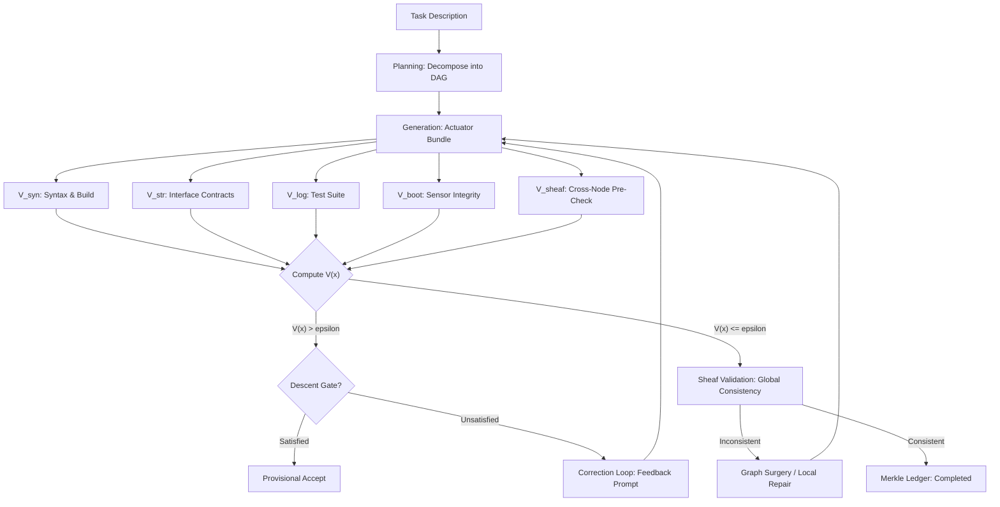

# Perspt
**v0.6.2 "Hózhó"** - *Hózhó (Navajo) — A state of perfect balance, harmony, and continuous self-improvement.*
**Your Terminal's Window to the AI World**

> "The keyboard hums, the screen aglow,\
>  AI's wisdom, a steady flow.\
>  Will robots take over, it's quite the fright,\
>  Or just provide insights, day and night?\
>  We ponder and chat, with code as our guide,\
>  Is AI our helper or our human pride?"

Perspt (pronounced "perspect," short for **Per**sonal **S**pectrum **P**ertaining **T**houghts) is a terminal-based interface to Large Language Models, built in Rust. It does two things:

1. **Chat with any LLM from your terminal.** Set an API key, run `perspt`, and start talking. Supports OpenAI, Anthropic, Google Gemini, Groq, Cohere, xAI, DeepSeek, AWS Bedrock, Google Agent Platform (Vertex AI), and Ollama out of the box.

2. **Run an experimental autonomous coding agent.** The SRBN (Stabilized Recursive Barrier Network) engine decomposes coding tasks into a DAG of nodes, generates code, verifies each node with real LSP diagnostics and tests, and commits only when Lyapunov energy converges. SRBN is based on the three-paper *Stability is All You Need* series. Agent mode is under active development; the theoretical framework is mature, but the implementation has not yet been benchmarked.

[](https://github.com/user-attachments/assets/f80f7109-1615-487b-b2a8-b76e16ebf6a7)

---

## Quickstart

```bash
# Clone the repository
git clone https://github.com/eonseed/perspt.git
cd perspt

# Build the release binary
cargo build --release

# Set an API key and launch the TUI chat
export GEMINI_API_KEY="your-api-key"
./target/release/perspt

# Or use simple CLI mode for scripting
./target/release/perspt simple-chat
```

Perspt auto-detects whichever provider key you have set. No config file required.

| Provider   | Environment Variable    | API Key Required |
|------------|-------------------------|------------------|
| OpenAI     | `OPENAI_API_KEY`        | Yes              |
| Anthropic  | `ANTHROPIC_API_KEY`     | Yes              |
| Gemini     | `GEMINI_API_KEY`        | Yes              |
| Groq       | `GROQ_API_KEY`          | Yes              |
| Cohere     | `COHERE_API_KEY`        | Yes              |
| xAI        | `XAI_API_KEY`           | Yes              |
| DeepSeek   | `DEEPSEEK_API_KEY`      | Yes              |
| AWS Bedrock| `AWS_ACCESS_KEY_ID` (and region/creds) | Yes              |
| Google Agent Platform | Google Cloud ADC plus project/region | Yes              |
| Ollama     | *(none)*                | No               |

---

## What You Get

**Interactive TUI** -- A Ratatui-powered chat interface with markdown rendering, streaming responses, smooth scrolling, and conversation export (`/save`).

**Simple CLI Mode** -- A minimal prompt for direct Q&A, piping, and session logging. Ideal for scripting and accessibility.

**Agent Mode (SRBN) [Experimental]** -- An autonomous coding assistant that plans multi-file projects as directed acyclic graphs, verifies correctness through LSP diagnostics and test runners, and self-corrects until energy converges below a configurable threshold. Based on the SRBN paper series; under active development.

**Web Dashboard** -- A browser-based monitoring interface for observing agent execution in real time. Shows DAG topology, energy convergence, LLM telemetry with token usage and latency, sandbox branches, and decision traces. Built with Axum, Askama, HTMX, and DaisyUI 5. Can be launched standalone (`perspt dashboard`) or embedded in the agent process (`perspt agent --dashboard`) for live monitoring during execution. The embedded mode opens a read-only DuckDB connection alongside the agent's writer, so it never interferes with the running session.

**Zero-Config Startup** -- Automatic provider detection from environment variables. Set a key and go.

**Local Models via Ollama** -- Full privacy, no API fees, works offline.

---

## Why SRBN is Different

Most coding agents work by trial and error: generate code, check if it compiles, and retry if it fails. This is fine for small tasks, but it breaks down as projects grow. Each step has a chance of going wrong, and those chances multiply. A ten-file project might need dozens of retries; a fifty-file project might never finish.

Two problems make this worse:

- **Errors compound.** Each generation step builds on the previous one. A small mistake early on gets baked into everything that follows. By the time the agent notices, the fix requires re-doing most of the work.

- **Retries don't help when the agent is lost.** If the agent conditions on its own broken output, it tends to repeat the same class of mistake. Blind re-prompting circles around the problem instead of converging on a solution.

SRBN takes a different approach. Instead of hoping each step is correct, it **measures how wrong the current state is** and **steers corrections based on that measurement**. Think of it like a thermostat, not a dice roll:

1. **Break the task into pieces.** The Architect decomposes your request into a graph of subtasks, each owning specific files.

2. **Generate code for each piece.** The Actuator writes code for one node at a time.

3. **Measure the damage.** Real tools -- your actual LSP server, your actual test runner, your actual compiler -- score the output. Zero means perfect. Higher means more broken.

4. **Fix what's broken, specifically.** The error details (which diagnostic, which test, which file) go back to the model as targeted context. This is not "try again"; it is "here is exactly what is wrong."

5. **Only commit when stable.** The score must drop below a threshold before the node is accepted. Then adjacent nodes are checked for consistency -- do imports resolve, do types match across files?

The theoretical result: instead of reliability decaying exponentially with project size, the paper predicts that retry cost grows logarithmically. A hundred-node project should cost only modestly more than a ten-node one.

This approach is based on the three-paper *Stability is All You Need* series. Paper I gives the Lyapunov-guided SRBN stability certificate; Paper II turns it into an observed harness with descent-gated acceptance; Paper III lifts it into a capability-constrained platform contract. Perspt's agent mode is an experimental implementation of this theory -- the mathematical framework is mature, but repository-level benchmarks have not yet been published. The next section covers the theory for those interested.

**PSP-7 hardening.** The correction loop uses a fail-closed typed parse pipeline (five layers from raw capture to semantic validation) so malformed LLM output is classified rather than silently dropped. A prompt compiler with provenance tracking replaces ad-hoc template constants. Every correction attempt is recorded with its parse state, retry classification, and energy snapshot for full observability via `perspt status` and the web dashboard.

---

## Theoretical Foundation

The SRBN engine is grounded in the theoretical framework from the *Stability is All You Need* paper series. This section presents the mathematical machinery for researchers and developers who want to understand the theoretical guarantees.

> **Note:** The theorems below are results from the SRBN papers. They describe properties of the formal system under stated assumptions. Perspt implements this framework as an experimental agent, but these theoretical results have not yet been empirically validated through published benchmarks on this implementation.

### The Problem, Formally

Over $N$ generation steps with per-step error rate $\delta$, the probability of a fully correct output decays as $(1 - \delta)^N$ -- exponential degradation. When the agent conditions on its own erroneous output, errors correlate rather than cancel (correlated entropy collapse), making naive retry ineffective.

### Core Idea: Sheaf-Theoretic Control

SRBN reformulates LLM agency as a **sheaf over a task DAG**. Each node in the DAG owns a set of output files. A sheaf assigns local data (code, tests, configs) to each node, subject to a **consistency condition**: overlapping data between adjacent nodes must agree.

The system evaluates a canonical **quadratic residual energy**: each sensor $e$ emits a residual with a non-negative magnitude $r_e(x) \geq 0$, and the energy $V(x)$ is a weighted sum of their squares:

$$
V(x) = \sum_{e \in E} w_e \, \lVert r_e(x) \rVert^2, \qquad w_e > 0
$$

We group the individual residuals into five component rollups:

$$
V(x) = V_{\text{syn}} + V_{\text{str}} + V_{\text{log}} + V_{\text{boot}} + V_{\text{sheaf}}
$$

| Barrier | What It Measures | Mapped Residual Classes (Default Weights) |
|---------|-----------------|-------------------------------------------|
| $V_{\text{syn}}$ | Syntactic energy | `Syntax` (4.0), `Type` (3.0), `Build` (3.0) |
| $V_{\text{str}}$ | Structural energy | `ImportGraph` (2.0), `SymbolMismatch` (2.0), `InterfaceMismatch` (2.5), `OwnershipViolation` (2.0), `Policy` (1.0), `Dependency` (1.5), `Manifest` (1.5), `Format` (0.25) |
| $V_{\text{log}}$ | Logical energy | `TestFailure` (2.0), `Runtime` (2.0), `Regression` (3.0) |
| $V_{\text{boot}}$ | Bootstrap energy | `SensorUnavailable` (1.0), `ToolFailure` (1.0) |
| $V_{\text{sheaf}}$ | Sheaf energy | `SheafInconsistency` (2.0) |

The legacy `--energy-weights "alpha,beta,gamma"` flag is parsed and folded proportionally into the individual residual weights $w_e$ relative to reference defaults (where $\text{Syn}_{\text{default}} = 1.0$, $\text{Str}_{\text{default}} = 0.5$, and $\text{Log}_{\text{default}} = 2.0$), leaving the core mathematical engine as a pure sum of pre-weighted squares.

### Convergence and Gating

A candidate state $x$ is admitted to the accepted trajectory if and only if it satisfies the gating condition:

$$
\text{accept}(x) \iff V(x) \leq \varepsilon \quad \lor \quad V(x) < V(x_{\text{best}}) - \rho_{\text{gate}}
$$

where $\varepsilon$ is the convergence threshold (default $0.10$), $x_{\text{best}}$ is the best previously accepted state in the current node generation, and $\rho_{\text{gate}}$ is the minimum required descent step (default $0.50$).

### Key Theorems (from the Paper)

The paper proves three results that underpin SRBN's theoretical reliability model:

**Theorem 1 (Global Exponential Decay).** If the control law $u(x) = -K \nabla V(x)$ is applied at each retry step, then:

$$
V(x_t) \leq V(x_0) \cdot e^{-2\mu K t}
$$

where $\mu$ is the Polyak-Lojasiewicz constant of the energy landscape. Energy decays exponentially toward zero -- the system converges.

**Theorem 2 (Input-to-State Stability).** Under persistent bounded noise $\| w_t \| \leq \bar{w}$ (imperfect LLM outputs), the energy remains bounded:

$$
V(x_t) \leq V(x_0) \cdot e^{-\lambda t} + \frac{\bar{w}^2}{\lambda}
$$

The system does not need perfect LLM responses to converge. Bounded errors yield bounded deviation -- the hallmark of robust control.

**Corollary (Role of Topology).** Convergence rate depends on the **Fiedler value** $\lambda_2$ of the task DAG's Laplacian. Well-connected graphs (higher $\lambda_2$) converge faster; long chains converge slowly. This guides how the Architect should decompose tasks.

### How This Changes Reliability Scaling (Theoretical)

Traditional agents: reliability $\sim (1 - \delta)^N$ (exponential decay).

SRBN with Lyapunov control (paper prediction): retry cost $\sim O(\log N)$ for an $N$-node project.

The barrier mechanism is designed to transform the problem from "hope each step is correct" to "measure deviation, correct, and steer toward convergence." Whether Perspt's implementation fully realizes this theoretical scaling is an open empirical question.

### SRBN Control Loop

The following diagram illustrates how a coding task flows through the SRBN engine:


```mermaid
flowchart TD
    A["Task Description"] --> B["Planning: Decompose into DAG"]
    B --> C["Generation: Actuator Bundle"]
    C --> D1["V_syn: Syntax & Build"] & D2["V_str: Interface Contracts"] & D3["V_log: Test Suite"] & D4["V_boot: Sensor Integrity"] & D5["V_sheaf: Cross-Node Pre-Check"]
    D1 & D2 & D3 & D4 & D5 --> E{"Compute V(x)"}
    
    E -->|"V(x) > epsilon"| F{"Descent Gate?"}
    F -->|"Satisfied"| G["Provisional Accept"]
    F -->|"Unsatisfied"| H["Correction Loop: Feedback Prompt"]
    H --> C
    
    E -->|"V(x) <= epsilon"| I["Sheaf Validation: Global Consistency"]
    I -->|"Inconsistent"| J["Graph Surgery / Local Repair"]
    J --> C
    I -->|"Consistent"| K["Merkle Ledger: Completed"]
```

Each retry is not blind re-prompting. The correction loop is designed to project the LLM's output back toward the feasible manifold using the gradient of $V(x)$, providing targeted error context that directs the next generation.

For the complete theoretical treatment, proofs, and design rationale, see the [Perspt Book](https://eonseed.github.io/perspt/book/index.html).

---

## Commands

Perspt uses subcommands. Running `perspt` with no arguments defaults to `chat`.

| Command        | Description                                              |
|----------------|----------------------------------------------------------|
| `chat`         | Interactive TUI chat session (default)                   |
| `simple-chat`  | Simple CLI chat mode (no TUI)                            |
| `agent`        | Run SRBN agent for autonomous coding                     |
| `init`         | Initialize project configuration                         |
| `config`       | Manage configuration settings                            |
| `ledger`       | Query and manage the Merkle ledger                       |
| `status`       | Show lifecycle counts, energy breakdown, escalation reports |
| `resume`       | Resume a session with trust context                      |
| `abort`        | Abort the current agent session                          |
| `dashboard`    | Launch the web monitoring dashboard                      |
| `logs`         | View LLM token metrics and request/response logs         |

Global options: `-v` (verbose), `-c <FILE>` (config path), `-h` (help), `-V` (version).

---

## Agent Mode

Agent mode uses the experimental SRBN engine to autonomously write, test, and commit code.

### Quick Start

```bash
# Create a Python project from scratch
perspt agent "Create a Python calculator with add, subtract, multiply, divide"

# Work in an existing project
perspt agent -w /path/to/project "Add unit tests for the existing API"

# Fully autonomous (no prompts)
perspt agent -y "Refactor the parser for better error handling"
```

### How SRBN Works

See [Theoretical Foundation](#theoretical-foundation-stability-is-all-you-need) for the full mathematical treatment. In practice, the control loop for each task is:

1. **Sheafification** -- Architect decomposes the task into a JSON TaskPlan (DAG of nodes)
2. **Speculation** -- Actuator generates code for each node
3. **Verification** -- LSP diagnostics and tests compute Lyapunov energy $V(x)$
4. **Convergence** -- If $V(x) > \epsilon$, flow matching corrects with targeted error feedback
5. **Commit** -- When $V(x) \leq \epsilon$, record changes in the Merkle ledger

The energy function (quadratic residual energy since PSP-8):

$$
V(x) = \sum_{e \in E} w_e \, \lVert r_e(x) \rVert^2
$$

The component rollups ($V_{\text{syn}}$, $V_{\text{str}}$, $V_{\text{log}}$, $V_{\text{boot}}$, $V_{\text{sheaf}}$) are derived projections of this single energy sum, representing:

| Component | Source | Description |
|-----------|--------|-------------|
| $V_{\text{syn}}$ | LSP diagnostics | Syntactic diagnostics (compiler errors/warnings) |
| $V_{\text{str}}$ | Structural contracts | Contract and interface seals |
| $V_{\text{log}}$ | Test failures | Logic errors from test suite execution |
| $V_{\text{boot}}$ | Build environments | Setup and compilation exit codes |
| $V_{\text{sheaf}}$ | Cross-node sheaf | Shared interface and import consistency |

PSP-8 extends this coding loop into an SDK-first platform. The long-term design keeps scheduling, residual scoring, capability checks, replay, and dashboard projection in the SRBN SDK, while coding, research, website-building, and other domains provide their own verifier suites and admissible effects.

### Workspace Classification

Before running a task, the agent inspects the workspace:

| State              | Detection                                     | Behavior                                          |
|--------------------|-----------------------------------------------|---------------------------------------------------|
| Existing Project   | `Cargo.toml`, `pyproject.toml`, etc. found    | Skip init, sync tooling, gather project context   |
| Greenfield         | Empty dir or language inferred from task      | Run language-native init, isolate in child dir    |
| Ambiguous          | Non-empty dir, no project files               | Create a child project dir to avoid conflicts     |

### Review and Approval

Each node presents a grouped diff review with verification context:

| Key | Action           | Description                                 |
|-----|------------------|---------------------------------------------|
| `y` | Approve          | Accept the node and commit to ledger        |
| `n` | Reject           | Discard and re-generate                     |
| `c` | Correct          | Send targeted feedback for the agent to fix |
| `e` | Edit externally  | Open files in your editor, then return      |
| `d` | View Diff        | Toggle full unified diff view               |

### Retry Policy

| Error Type          | Max Retries | On Exhaustion      |
|---------------------|-------------|--------------------|
| Compilation errors  | 3           | Node escalated     |
| Tool failures       | 5           | Node escalated     |
| Review rejections   | 3           | Node escalated     |

Escalated nodes do not block the remaining DAG. After all nodes are processed,
the session derives a `SessionOutcome`: **Success** (all completed),
**PartialSuccess** (some escalated), or **Failed** (none completed).

### Headless Mode

With `--yes`, the agent runs fully autonomously and prints structured progress:

```
[VERIFY]   syntax=ok build=ok tests=8/8 lint=ok degraded=false
[ENERGY]   V(x)=0.05 boot=0.00 sheaf=0.00
[ESCALATE] 0 escalations
[OUTCOME]  Success
[COMMIT]   session abc123 committed
```

### Agent Options

```
perspt agent [OPTIONS] <TASK>

  -w, --workdir <DIR>              Working directory (default: current)
  -y, --yes                        Auto-approve all actions
      --auto-approve-safe          Auto-approve only safe operations
  -k, --complexity <K>             Max sub-graph complexity (default: 5)
      --mode <MODE>                cautious | balanced | yolo (default: balanced)
      --model <MODEL>              Model for all tiers
      --architect-model <M>        Model for Architect tier
      --actuator-model <M>         Model for Actuator tier
      --verifier-model <M>         Model for Verifier tier
      --speculator-model <M>       Model for Speculator tier
      --architect-fallback-model <M>  Fallback model for Architect tier
      --actuator-fallback-model <M>   Fallback model for Actuator tier
      --verifier-fallback-model <M>   Fallback model for Verifier tier
      --speculator-fallback-model <M> Fallback model for Speculator tier
      --energy-weights <a,b,g>     Lyapunov weights (default: 1.0,0.5,2.0)
      --stability-threshold <e>    Convergence threshold (default: 0.1)
      --max-cost <USD>             Cost limit (0 = unlimited)
      --max-steps <N>              Iteration limit (0 = unlimited)
      --defer-tests                Defer tests until sheaf validation
      --single-file                Force single-file Solo Mode
      --verifier-strictness <S>    default | strict | minimal (default: default)
      --log-llm                    Log verbose LLM prompts/responses (token metrics always recorded)
      --output-plan <FILE>         Export task graph as JSON after planning
      --dashboard                  Start web dashboard alongside the agent
      --dashboard-port <PORT>      Dashboard port (default: 3000)
```

---

## Configuration

Perspt is configured via environment variables, a TOML config file, or CLI arguments.

**Environment variable (simplest):**

```bash
export OPENAI_API_KEY="sk-..."
perspt
```

**Config file (`config.toml`):**

Perspt reads `config.toml` from the platform config directory:

- Linux: `~/.config/perspt/config.toml`
- macOS: `~/Library/Application Support/perspt/config.toml`
- Windows: `%APPDATA%\perspt\config.toml`

```toml
provider = "openai"
model = "gpt-4o-mini"
api_key = "sk-..."
# Optional: override the endpoint for OpenAI-compatible / local servers
# base_url = "http://localhost:8000/v1"
```

Manage it from the CLI:

```bash
perspt config --show                       # show the effective config (keys masked)
perspt config --set provider=openai        # set a value (structured TOML write)
perspt config --set default_model=gpt-4o-mini
perspt config --edit                       # open in $EDITOR
perspt --config ./my-config.toml config --show   # use an explicit file
```

**CLI arguments:**

```bash
perspt chat --model claude-sonnet-4-20250514
perspt simple-chat --model gpt-4o-mini
```

### Custom and local (OpenAI-compatible) models

Custom model names that genai does not recognize (for example `phi-4-npu-ov`)
are routed to the provider you configure, so set both `provider` and `model`:

```toml
provider = "openai"
model = "phi-4-npu-ov"
base_url = "http://localhost:8000/v1"
```

You can also point any provider at a local endpoint with its `*_BASE_URL`
environment variable (`OPENAI_BASE_URL`, `OLLAMA_BASE_URL`, etc.), or target a
specific adapter inline with namespacing: `openai::phi-4-npu-ov`.

---

## Using Ollama for Local Models

Ollama runs models locally with no API key and no internet connection.

```bash
# Install
brew install ollama        # macOS
# curl -fsSL https://ollama.ai/install.sh | sh   # Linux

# Start and pull a model
ollama serve
ollama pull llama3.2

# Use with Perspt
perspt chat --model llama3.2
```

Benefits: full privacy, zero API cost, offline operation.

---

## Chat Interface

### Features
- **Markdown and ASCII Tables**: Render rich text replies including multi-line box-drawn tables with clean Unicode borders.
- **LaTeX Math Equations**: Automatically transpile LaTeX code segments into beautiful styled Unicode formulas (cyan and bold).
- **Reasoning Process Display**: Toggle show/hide of model inner thinking process on the fly.

### Key Bindings

| Key              | Action                                                |
|------------------|-------------------------------------------------------|
| Enter            | Send message                                          |
| Esc              | Exit application                                      |
| Ctrl+C / Ctrl+D  | Cancel current stream or exit session                 |
| Ctrl+R           | Toggle inner reasoning process display                |
| Shift+Up/Down    | Scroll chat pane line-by-line                         |
| Page Up/Down     | Fast scroll chat pane page-by-page                    |
| Ctrl+A / Ctrl+E  | Jump cursor to start / end of input line              |
| Ctrl+B / Ctrl+F  | Move cursor left / right by one character             |
| Ctrl+D / Ctrl+H  | Delete character at / before cursor (Backspace)       |
| Ctrl+K / Ctrl+U  | Delete text from cursor to end / start of input line  |
| Ctrl+W           | Delete word before cursor                             |

### Built-in Commands

| Command           | Description                                                        |
|-------------------|--------------------------------------------------------------------|
| `/exit` or `/quit`| Exit the chat session cleanly                                      |
| `/clear`          | Reset the conversation history and clear screen                    |
| `/model <name>`   | Switch the active LLM model on the fly                             |
| `/save <file>`    | Export the entire conversation history to a clean markdown file   |
| `/help`           | Display the help menu of available slash commands                 |

---

## Architecture

Perspt is organized as a Cargo workspace with nine crates:

```
perspt/crates/
  perspt-cli       CLI entry point and subcommand dispatch
  perspt-core      Configuration, LLM provider adapter (genai), events, types
  perspt-tui       Terminal UI (Ratatui)
  perspt-agent     SRBN orchestrator, tools, LSP client, test runner
  perspt-store     Session persistence (DuckDB)
  perspt-policy    Security policy engine (Starlark)
  perspt-sandbox   Process isolation
  perspt-dashboard Web dashboard (Axum + HTMX + DaisyUI 5)
  perspt           Meta-crate that re-exports all workspace libraries
```

Key implementation details:

- **genai crate** provides unified streaming access to all LLM providers
- **Ratatui** powers the TUI with a custom markdown-to-lines renderer
- **Tokio** async runtime for concurrent streaming and non-blocking UI
- **DuckDB** persists session state, energy history, and the Merkle ledger
- **Axum + HTMX** powers the real-time web dashboard for agent monitoring
- **Starlark** evaluates security policies that gate file writes and command execution

The SRBN engine is an experimental implementation of the theoretical framework described in the *Stability is All You Need* paper series. The series reformulates LLM agency as a sheaf-theoretic control problem, replacing probabilistic search with Lyapunov stability analysis, observed harness contracts, and capability-constrained platform control. See the [Theoretical Foundation](#theoretical-foundation) section for details.

---

## Troubleshooting

**API key not found:**

```bash
export OPENAI_API_KEY="your-key-here"
# or store it in the config file
perspt config --set api_key=YOUR_KEY
```

**Connection timeout:** Verify your internet connection and API key validity. Try a different provider or model.

**Ollama not connecting:**

```bash
ollama serve                              # ensure it is running
curl http://localhost:11434/api/tags      # verify connectivity
```

---

## Documentation

For a comprehensive guide covering installation, configuration, tutorials, the SRBN architecture, developer internals, and the API reference, read the **[Perspt Book](https://eonseed.github.io/perspt/book/index.html)** (also available as [PDF](docs/perspt_book/build/latex/perspt.pdf)).

---

## Contributing

Contributions are welcome. See [CONTRIBUTING.md](CONTRIBUTING.md) for guidelines.

```bash
cargo test --all-features -- --test-threads=1  # run tests
cargo clippy --all-targets --all-features -- -D warnings  # lint
cargo fmt --all -- --check                     # formatting
```

## License

LGPL-3.0. See [LICENSE](LICENSE) for details.

## Acknowledgments

- [genai](https://crates.io/crates/genai) -- Unified LLM provider access
- [Ratatui](https://ratatui.rs/) -- Terminal UI framework
- [Tokio](https://tokio.rs/) -- Async runtime
- [DuckDB](https://duckdb.org/) -- Embedded analytics database
- The LLM provider communities for their APIs and models
