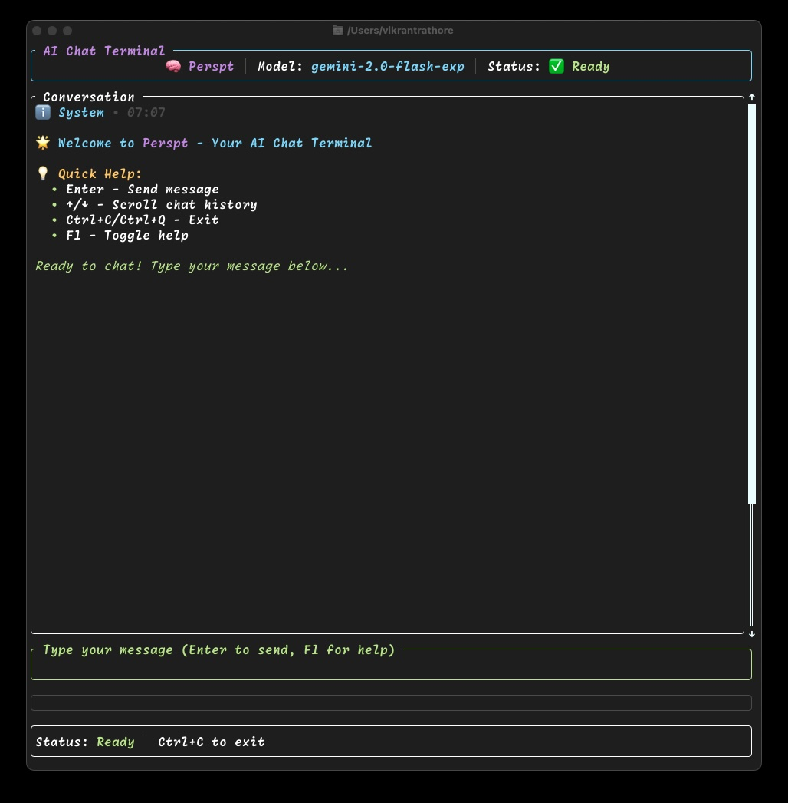

# Perspt

**v0.6.6**

Perspt is a Rust terminal interface for large language models and an experimental,
verification-driven agent platform. It provides:

1. Interactive TUI chat and a simple script-friendly CLI.
2. A governed coding agent built on the SRBN ideas developed in the three-paper
   *Stability is All You Need* series.
3. A domain-neutral SDK for residuals, energy, gates, capabilities, scheduling,
   replay, calibration, and observability.
4. Coding and research domain packages that supply domain-specific tools and
   verifier evidence.

[](https://github.com/user-attachments/assets/f80f7109-1615-487b-b2a8-b76e16ebf6a7)

Perspt is pre-1.0. The coding path works end to end, but the full PSP-9 roadmap
is not complete. See [PSP 9](docs/psps/source/psp-000009.rst), especially its
Implementation Status table, for the authoritative boundary between live code,
tested SDK mechanisms, and future work.

## Quick Start

Perspt uses the pinned Rust 1.97.1 toolchain (edition 2021).

```bash
git clone https://github.com/eonseed/perspt.git
cd perspt
cargo build --release

export GEMINI_API_KEY="your-api-key"
./target/release/perspt
```

Useful entry points:

```bash
# Interactive chat
perspt chat

# Plain CLI chat
perspt simple-chat --model gemini-3.5-flash

# Governed coding agent
perspt agent -w ./project "Fix the failing parser tests"

# Headless final promotion
perspt agent --yes -w ./project "Add validation for empty input"

# Monitor a run
perspt agent --dashboard --dashboard-port 3000 -w ./project "Add tests"
```

## Providers

Perspt supports OpenAI, Anthropic, Gemini, Groq, Cohere, xAI, DeepSeek, AWS
Bedrock, Vertex AI, Ollama, and OpenAI-compatible endpoints through the `genai`
transport.

| Provider | Common credential |
|---|---|
| OpenAI | `OPENAI_API_KEY` |
| Anthropic | `ANTHROPIC_API_KEY` |
| Gemini | `GEMINI_API_KEY` |
| Groq | `GROQ_API_KEY` |
| Cohere | `COHERE_API_KEY` |
| xAI | `XAI_API_KEY` |
| DeepSeek | `DEEPSEEK_API_KEY` |
| AWS Bedrock | AWS credential chain and region |
| Vertex AI | Google Cloud Application Default Credentials |
| Ollama | none |

One provider is enough for chat. Agent mode can use a portfolio:

```toml
[providers.vertex]
project_id = "your-google-cloud-project"
location = "global"

[providers.local]
adapter = "openai"
api_key_env = "LOCAL_LLM_API_KEY"
base_url = "http://localhost:8000/v1"

[models]
actuator = "vertex::gemini-3.5-flash-lite"
speculator = "local::your-cheap-model"
adjudicator = "vertex::gemini-3.5-flash-lite"
```

Vertex uses ADC at request time. Perspt does not require project, location, or
credentials to be hard-coded in the binary. Fully qualified model IDs use
`provider::model`.

## Governed Agent

`perspt agent` runs the PSP-9 tool loop. A model never writes directly to the
source workspace:

1. Perspt maps the repository deterministically. An optional cheaper explorer
   can summarize that map without tools or mutation authority.
2. The actuator proposes typed tool calls against a disposable candidate
   overlay.
3. Every proposal is checked by the deterministic five-clause kernel:
   authority, contract, effect scope, barrier increment, and risk budget.
4. Admitted mutations are measured on the realized filesystem using available
   language plugins, compilers, tests, linters, runtime checks, and LSP tools.
5. Rejected candidates restore the best accepted checkpoint. Finite turn,
   call, rejection, recovery, and verification-cadence budgets prevent an
   unbounded unchecked loop.
6. A hard-passing candidate may be reviewed by an optional no-tool adjudicator
   and approved by the user. Promotion is write-ahead journaled and applies
   only governed paths.
7. Every observation and decision is appended to a hash-chained ledger before
   it is used.

The initial model-facing schema is intentionally small. `tool_search` activates
deferred typed tools, while bounded pure Starlark `tool_program` calls can
compose several proposals. Every nested proposal returns to the same kernel.
Read-only OS inspection uses direct argv execution for an allowlisted set of
tools such as `rg`, `git`, `sed`, and `awk`; shell composition is not an implicit
fallback.

### Open extension surfaces

The execution plane is a set of registries, so growing the agent is a
registration at the composition root, never an edit to the loop, the
candidate, or the node assembly:

- **Tool families** register catalog entries
  (`Psp9AgentRuntime::with_tool_family`) and handlers
  (`CandidateHandlerRegistry::register`); grants derive from the assembled
  catalog. Two read-only families ship this way: a system explorer
  (`sys_info`, `sys_processes`, `sys_disk`, `sys_env` — names only, never
  values) and a local DB explorer (`db_list`, `db_schema`, `db_query` —
  SELECT-only over an in-memory read-only DuckDB view of one workspace data
  file).
- **Domains** register in a `DomainRegistry` and are selected by `--domain`
  or detection; the coding and research domain packages are both wired.
- **Languages** register `LanguageAdapter`s (diagnostics) and
  `LanguagePlugin`s (commands, incl. governed dependency mutation) by id.
- **External MCP servers** are configured under `[[external_tools]]` (stdio
  or Streamable HTTP). Every listed tool passes admission against the
  session's grant surface — a server can never exceed what the user could
  grant — and each call is write-ahead bracketed in the ledger. The
  interactive `perspt chat` reuses the same servers with a read-only
  admission ceiling; `simple-chat` keeps the plain streaming path.

Governed dependency mutation (`cargo add`, `uv add`, `npm install`) is an
explicit opt-in via `--allow-dependency-mutation`. Gate failures can draw a
distinct-family proposal ensemble round (`[ensemble]` in config or
`--ensemble-width`); selection is strictly by measured energy.

On macOS and Linux, model-triggered processes require OS isolation. Inspection
processes cannot write the candidate, access unrelated user home directories,
or reach the network. Compiler, test, and lint sensors can run concurrently in
isolated target directories under `--max-parallel`.

### Agent Options

```text
perspt agent [OPTIONS] <TASK>

  -w, --workdir <DIR>           Workspace root
  -y, --yes                     Approve final promotion
      --model <MODEL>           Primary actuator alias
      --actuator-model <MODEL>  Governed tool-call route
      --explorer-model <MODEL>  Optional cheap no-tool explorer
      --adjudicator-model <M>   Optional no-tool diff veto
      --fallback-model <MODEL>  Sticky actuator fallback; repeatable
      --rho-gate <V>            Required measured descent (default: 0.5)
      --max-turns <N>           Model-turn bound (default: 12)
      --max-calls-per-turn <N>  Direct and nested call bound (default: 8)
      --rejection-budget <N>    Shared rejection/recovery budget (default: 4)
      --max-parallel <N>        Concurrent verifier sensors (default: 4)
      --max-parallel-nodes <N>  Concurrent work-graph nodes (default: 1; needs --yes)
      --domain <ID>             Domain package (coding, research); default: detect
      --allow-dependency-mutation  Grant governed dependency mutation
      --ensemble-width <N>      Enable proposal ensembles after gate failures
      --persistent-grants       Persist signed grant intent
      --output-summary <FILE>   Write the terminal summary as JSON
      --db-path <FILE>          Use a specific PSP-9 ledger database
      --dashboard               Start the monitoring dashboard
      --dashboard-port <PORT>   Dashboard port (default: 3000)
```

`--yes` approves only final promotion within existing authority. It does not
grant shell, network, policy, graph, secret, or out-of-workspace access.
Role-specific explorer and adjudicator models are never silently reused as
actuator fallbacks.

## Mathematical Contract

Each verifier sensor emits a non-negative residual magnitude
`r_e(x) >= 0`. Perspt computes one canonical quadratic energy:

```math
V(x) = \sum_{e \in E} w_e \lVert r_e(x) \rVert^2, \qquad w_e > 0.
```

The syntax, structural, logical, bootstrap, and sheaf values shown in the UI
are projections of this sum, not separately tunable acceptance functions.

For a realized candidate `y`, the discrete gate is:

```math
\operatorname{accept}(y)
\iff
\operatorname{hard\_pass}(y)
\;\lor\;
V(y) \le V(x_{best}) - \rho_{gate}.
```

With baseline energy `V_0`, descent size `rho_gate`, and rejection budget `B`,
the accepted-trajectory mechanism has the finite decision bound

```math
\left\lfloor \frac{V_0}{\rho_{gate}} \right\rfloor + B + 1.
```

The coding domain does **not** claim continuous-time constants, a realizability
geometry, asymptotic convergence, conformal risk, or verifier independence
unless the required evidence exists. Cold-start calibration records
`certified_for_promotion = false`; current promotion relies on deterministic
contracts, measured safety barriers, and compiler/test evidence. This
distinction is deliberate: the papers' theorems are conditional, so the
implementation must not turn an unmeasured assumption into a guarantee.

The work graph is revisioned rather than permanently fixed. New nodes and edges
can be added, replaced, or retired while preserving acyclicity and generation
bindings. Evidence-driven refinement is live in the recovery ladder. Live
multi-node worker dispatch remains a roadmap item; the current authoritative
coding runtime executes one governed node while verifier sensors run in
parallel.

## Reliability and Recovery

- Candidate edits are reversible until final promotion.
- Long outputs are content-addressed; models receive bounded previews.
- Conversation compaction preserves a verbatim control frame and unresolved
  tool calls while treating summaries as untrusted observations.
- Provider failover is sticky, explicit, and charged to one non-replenishing
  recovery pool.
- Persistent grants store signed policy intent, never live capabilities.
- Promotion rechecks the authority epoch and uses an idempotent before/after
  artifact manifest.
- `perspt replay <SESSION_ID>` verifies the ledger and accepted trajectory
  without calling a provider or reading provider credentials.
- `perspt resume <SESSION_ID>` can finish an interrupted journaled promotion.
  It can also reconstruct the last accepted candidate from content-addressed
  artifacts, restore its provider-neutral conversation, graph revision, sticky
  route and activated tool set, re-mint epoch-bound capabilities, and continue
  with exactly its remaining turn and rejection budgets.

External MCP tools are an optional edge integration, not the default coding
tool plane. The shared runtime supports lazy stdio and Streamable HTTP
lifecycles, paginated discovery, local schema/admission checks, namespaced
tools, bounded observations, and provider-free replay. An external server
cannot mint authority or classify its own effects. Agent and chat construct
separate lifecycles from the same `[[external_tools]]` configuration: the
governed loop admits against the session's grant surface, while the TUI chat
admits read-only effects only.

## Chat and Local Commands

The TUI supports markdown, tables, math rendering, conversation export, model
switching, and streaming. Common commands include `/help`, `/clear`, `/model`,
`/save`, and `/quit`. With chat-enabled `[[external_tools]]` servers, chat
turns can call the admitted read-only MCP tools; tool activity is shown
inline and results are labeled untrusted.

Entering `l-o-v-e` in chat, agent mode, the TUI, or simple CLI mode is handled
locally and never sent to an LLM. It prints Perspt's family dedication.

## Commands

| Command | Purpose |
|---|---|
| `chat` | Interactive TUI chat |
| `simple-chat` | Plain terminal chat |
| `agent` | Governed PSP-9 coding agent |
| `providers` | Show configured portfolio capabilities |
| `replay` | Provider-free PSP-9 audit replay |
| `resume` | Resume or finish recoverable session state |
| `dashboard` | Web monitoring UI |
| `db repair` | Back up and quarantine a poisoned DuckDB WAL |
| `status` | Session and stability status |
| `ledger` | Query the ledger; `--rollback <SESSION>` undoes the newest promotion and labels it unsafe |
| `config` | Inspect or edit configuration |
| `init` | Initialize project memory and policy |

Run `perspt <COMMAND> --help` for the current interface.

## Workspace

Perspt is a Cargo workspace with these published implementation layers:

| Crate | Responsibility |
|---|---|
| `perspt-sdk` | Domain-neutral SRBN control plane |
| `perspt-coding` | Coding residuals, barriers, adapters, and verifier policy |
| `perspt-research` | Research domain package |
| `perspt-agent` | Candidate runtime, exploration, tool loop, LSP, scheduling |
| `perspt-core` | Configuration, provider portfolio, transport mirrors, events |
| `perspt-policy` | Starlark policy and bounded tool programs |
| `perspt-sandbox` | Governed process execution |
| `perspt-store` | DuckDB ledger, artifacts, grants, verdicts, calibration |
| `perspt-tui` | Ratatui interfaces |
| `perspt-dashboard` | Axum/HTMX observability UI |
| `perspt-cli` | Command-line entry point |
| `perspt` | Re-exporting meta-crate |

The implementation uses the published [`srbn`](https://crates.io/crates/srbn),
`srbn-serde`, and `srbn-ledger` crates. Their source is maintained in the
[`srbn-rust`](https://codeberg.org/insanai/srbn-rust) repository.

## Development

```bash
cargo fmt --all -- --check
cargo clippy --workspace --all-targets -- -D warnings
cargo test --workspace --all-targets
cargo deny check
```

Build the documentation:

```bash
make -C docs/perspt_book html
make -C docs/psps html
```

## Documentation

- [Perspt Book](https://eonseed.github.io/perspt/book/index.html)
- [PSP 8: SRBN SDK and domain packages](docs/psps/source/psp-000008.rst)
- [PSP 9: governed tool-loop platform](docs/psps/source/psp-000009.rst)

The *Stability is All You Need* papers I, II, and III are forthcoming. PSP 9's
bibliography names the paper-level definitions and theorems used by each
mechanism; source `.typ` files are intentionally not cited.

## Contributing

See [CONTRIBUTING.md](CONTRIBUTING.md).

## License

LGPL-3.0. See [LICENSE](LICENSE).
