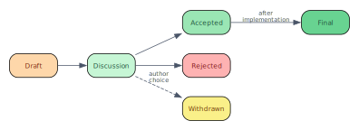
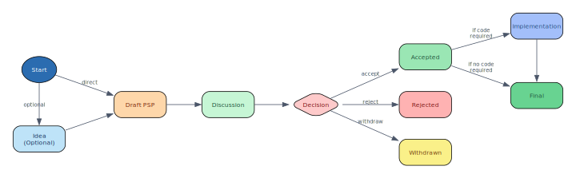

PSP: 000001
Title: PSP Purpose and Guidelines
Author: Vikrant Rathore (@vikrantrathore), Ronak Rathore (@ronakrathore)
Status: Active
Type: Process
Created: 2025-06-11
Discussion-To: https://github.com/your-org/perspt/issues/PSP-GUIDELINES

========
Abstract
========

This PSP defines the purpose, process, and guidelines for Perspt Specification Proposals (PSPs). PSPs provide a structured way to propose significant changes, collect community input, and document design decisions for Perspt through GitHub-native workflows with automation support.

==========
Motivation
==========

Perspt is a terminal user interface (TUI) application that requires careful consideration of user experience, feature design, and technical implementation. As Perspt evolves, we need a structured yet lightweight process for:

1. **Proposing significant changes** while avoiding bureaucracy for minor fixes
2. **Documenting design decisions** with focus on TUI-specific considerations
3. **Building community consensus** through GitHub-native discussion workflows
4. **Maintaining project history** through version-controlled PSP documents

The PSP process balances structure with simplicity, using GitHub automation to minimize administrative overhead while ensuring thorough consideration of major changes.

================
Proposed Changes
================

What Makes a Good PSP?
======================

A successful PSP must meet these essential criteria:

**Core Requirements:**

* **Clear Purpose Statement:** Addresses a specific need in Perspt's technical, community, or process domain
* **Complete Specification:** Provides sufficient detail for implementation or adoption
* **Community Value:** Represents a net improvement for the Perspt ecosystem
* **Actionable Content:** Includes concrete steps or specifications that can be acted upon
* **Appropriate Scope:** Focused on a single key proposal or process change

**Quality Standards:**

* **Focused Scope:** Single key proposal per PSP (split complex changes into multiple PSPs)
* **Evidence-Based:** Includes user feedback, community input, or technical justification
* **Well-Researched:** Shows consideration of alternatives and existing practices
* **Clear Documentation:** Written in accessible language with examples where helpful
* **GitHub-Native:** Leverages GitHub tools and automation for efficient workflow

**Type-Specific Considerations:**

* **Feature/Enhancement PSPs:** Consider TUI constraints, accessibility, keyboard navigation, performance
* **Process PSPs:** Address workflow efficiency, automation opportunities, community participation
* **Informational PSPs:** Provide valuable guidance, document decisions, or establish conventions
* **Community PSPs:** Foster collaboration, improve communication, or establish governance

PSP Categories and Thresholds
=============================

**Requires PSP (Significant Changes):**

*Technical Changes:*

   * New major features or capabilities
   * Changes to command-line interface or core architecture
   * Modifications to configuration format or data structures
   * UI/UX pattern changes affecting user workflows

*Process & Community Changes:*

   * Development workflow modifications
   * Contribution guidelines updates
   * Release or maintenance process changes
   * Community governance or decision-making processes
   * Documentation standards or tooling changes

*Informational Content:*

   * Design philosophy documentation
   * Best practices and conventions
   * Community guidelines and codes of conduct
   * Technical decision records for significant choices

**Does NOT Require PSP (Minor Changes):**

   * Bug fixes without user-visible behavior changes
   * Performance improvements without API changes
   * Minor documentation corrections or updates
   * Code refactoring with identical external behavior
   * Routine maintenance tasks or dependency updates
   * Minor cosmetic adjustments to existing features

**GitHub Automation Support:**

   * Automated PSP detection using unified PR template with PSP checkbox
   * PSP validation ensuring both checkbox selection and PSP file presence
   * Status tracking and automated project board integration
   * Discussion thread management and notifications
   * Automated formatting and link validation
   * PR comment guidance for proper PSP submission process

PSP Types
=========

**Feature PSPs** introduce new functionality or capabilities to Perspt:

   * New UI components, interaction patterns, or user-facing features
   * Additional command-line options or modes
   * Integration with external tools or services

**Enhancement PSPs** improve existing Perspt functionality:

   * Performance improvements with user-visible impact
   * Usability improvements to existing features
   * Accessibility enhancements and inclusive design

**UI/UX PSPs** modify the terminal user interface or user experience:

   * Changes to visual design, layout, or interaction patterns
   * New keyboard shortcuts or navigation workflows
   * Terminal compatibility and rendering improvements

**API Change PSPs** modify Perspt's external interfaces:

   * Command-line interface modifications or extensions
   * Configuration file format changes or new options
   * Core architecture changes affecting extensibility

**Process PSPs** describe development, community, and governance processes:

   * Changes to the PSP process itself or development workflows
   * Contribution guidelines, code review, or release processes
   * Community governance, moderation, or decision-making procedures
   * Tooling and automation for development or community management

**Informational PSPs** document design decisions, conventions, or guidance:

   * Design philosophy and architectural principles
   * Best practices for Perspt development or usage
   * Community guidelines, codes of conduct, or communication norms
   * Technical decision records for significant architectural choices

PSP Lifecycle and Statuses
==========================

PSPs follow a straightforward lifecycle with clear status transitions:

**Draft:** The initial version under development by the author. PSP content may change significantly.

**Discussion:** Ready for community review and feedback. All discussion happens in a dedicated GitHub Issue.

**Accepted:** Approved by project maintainers for implementation. For Process PSPs, this means the process is adopted.

**Rejected:** Not approved by maintainers. Rationale is documented in the discussion issue.

**Final:** Implementation complete and merged. Only applies to PSPs involving code changes.

**Withdrawn:** Removed from consideration by the author at any stage.

Simplified PSP Workflow
=======================

**Phase 1: Idea & Initial Discussion (Optional)**
   Start with a GitHub Issue to gauge interest. If the change seems significant, proceed to create a PSP.

**Phase 2: Draft PSP & PR**
   1. **Author actions:**
   
      * Fork the repository
      * Copy `docs/psps/source/psp-template.rst` to `docs/psps/source/psp-0000-descriptive-name.rst`
      * Fill out the template with `status: Draft`
      * Create a GitHub Issue for PSP discussion
      * Submit a Pull Request using the unified PR template:
        - Check the "PSP" checkbox
        - Fill out the PSP-specific sections (PSP number, type, status)
        - Add the PSP file to the PR

   2. **Automated PSP detection:**
   
      * GitHub automation detects PSP PRs based on the checked "PSP" checkbox and presence of PSP files
      * Validation ensures both requirements are met for proper PSP processing

   3. **Maintainer review:**
   
      * Review PR for basic structure and completeness
      * Assign official PSP number (e.g., `0003`)
      * Author updates filename and PSP number in the document
      * Maintainer merges the PR (PSP officially becomes `Draft`)

**Phase 3: Discussion**
   1. Author updates PSP status from `Draft` to `Discussion` via new PR
   2. All discussion occurs in the dedicated GitHub Issue
   3. Author may submit additional PRs to update the PSP based on feedback

**Phase 4: Decision**
   1. Project maintainers decide to `Accept` or `Reject` the PSP
   2. Decision and rationale are documented in the GitHub Issue
   3. PSP status is updated via PR to reflect the decision

**Phase 5: Implementation (if Accepted)**
   1. Code changes developed in separate PR(s) referencing the PSP number
   2. PSP's Reference Implementation section can be updated with links

**Phase 6: Finalization**
   1. Once implementation is merged, PSP status changes to `Final` via PR

=========
Rationale
=========

This simplified PSP process is designed to be:

**Lightweight and Practical:** By leveraging GitHub's native tools (Issues, PRs, automation), we minimize administrative overhead while maintaining proper documentation and decision tracking.

**Community-Focused:** Dedicated GitHub Issues for each PSP ensure focused discussions while allowing maintainers to make final decisions based on community input.

**GitHub-Native:** Using familiar GitHub tools (Issues, PRs, Actions) makes the process accessible to developers and community members already contributing to Perspt, reducing barriers to participation while enabling powerful automation.

**Automation-Friendly:** The workflow supports GitHub Actions automation for PSP numbering, status tracking, project board updates, discussion management, and format validation, reducing manual administrative overhead.

**Community-Inclusive:** Process accommodates technical contributions, community governance, informational documentation, and process improvements, ensuring all types of valuable contributions have a structured pathway.

**TUI-Aware:** Special emphasis on terminal application considerations acknowledges that CLI tools have unique design constraints, accessibility requirements, and interaction patterns that differ from web or desktop applications.

**Scalable:** The process accommodates both small teams and larger contributor bases without becoming bureaucratic for routine changes.

=======================
Backwards Compatibility
=======================

This PSP establishes the foundational process for Perspt PSPs. Since this is the initial implementation:

* **No Existing PSPs:** This process applies to all future PSPs
* **Current Development:** Existing development practices continue unchanged for routine bug fixes and minor enhancements
* **Process Evolution:** Future changes to the PSP process will be handled through new PSPs (self-referential updates)

Migration from informal proposals to PSPs will happen gradually as contributors adopt the new process for significant changes.

=========================
Reference Implementation
=========================

The PSP process is implemented through:

1. **Process Documentation:** This PSP (000001) and the PSP Index (000000)
2. **PSP Template:** `docs/psps/source/psp-template.rst` with comprehensive guidance for all PSP types
3. **GitHub Integration:** Unified PR template with PSP checkbox, Issue templates for PSP discussions, and automated workflows
4. **Automation Support:** GitHub Actions workflows for PSP detection, validation, status tracking, and automated guidance
5. **Documentation System:** Sphinx configuration rendering PSPs to navigable website with cross-references and search
6. **Community Tools:** Discussion templates, review checklists, and status dashboards for transparency

**GitHub Automation Features:**
* Unified PR template with PSP type detection via checkbox
* PSP validation requiring both checkbox and PSP file presence
* Automated PR comments providing guidance for proper PSP submission
* Status transition validation and notifications
* Discussion thread linking and management
* Project board integration for tracking PSP progress
* Format and link validation in CI/CD pipeline
* Automated updates to PSP index and cross-references

**Assets Organization:** Each PSP can have an associated assets folder (`docs/psps/source/psp-NNNN/`) for diagrams, mockups, process flows, and other supporting materials.

============
Open Issues
============

Several aspects will be refined based on early PSP experience:

1. **Automation Enhancement:** Further optimize GitHub Actions automation for advanced PSP lifecycle management, enhanced notification systems, and deeper integration with project planning tools beyond the current detection and validation features
2. **Decision Authority:** Clarify final decision-making authority for different PSP types (technical, process, community, informational) and potential conflict resolution
3. **Review Requirements:** Establish whether PSPs need formal review from specific maintainers, community representatives, or domain experts
4. **Community Engagement:** Develop best practices for inclusive community discussion and consensus building across different PSP types
5. **Template Evolution:** Refine the PSP template based on real-world usage across technical, process, and informational PSPs
6. **Process Metrics:** Define success metrics for PSP adoption, community participation, and process efficiency

These questions will be addressed through experience and follow-up PSPs as the community grows and the process matures.

=========
Copyright
=========

This document is placed in the public domain or under the CC0-1.0-Universal license, whichever is more permissive.
