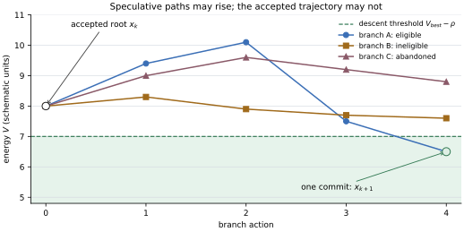

PSP: 000010
Title: Bounded Search Trajectories and Model-Conditioned Prompt Programs
Author: Vikrant Rathore (@vikrantrathore), Ronak Rathore (@ronakrathore)
Status: Draft
Type: Enhancement
Created: 2026-08-17
Discussion-To: https://github.com/eonseed/perspt/discussions/PSP-10
Extends: 000008, 000009

========
Abstract
========

Perspt admits a state only after a deterministic gate accepts it. It mediates
every effect through the admissibility kernel. It records the evidence for
each decision. :psp:`000009` made these rules part of the running system.

The gate is not a search method. A coding task may have many plausible paths.
Most paths fail. A useful harness must explore some of them without treating
every intermediate edit as progress.

Models also differ. They were trained and post-trained on different data.
They may respond best to different instructions and tool descriptions. One
prompt should not be assumed to fit every model family.

This PSP adds two mechanisms. It does not change the acceptance rule.

* A **bounded search forest** explores isolated branches. Every branch has
  the same accepted ancestor :math:`x_k`. A root branch starts there. A child
  branch may start from a content-addressed partial checkpoint made by its
  parent. A branch may regress or fail. Its intermediate states are not
  accepted states. The runtime measures branch candidates against the same
  accepted root. It selects one eligible candidate by a deterministic rule.
  Only that candidate is committed through the ordinary gate.

* A **model-conditioned prompt program** presents typed state to a model.
  A program is composed from small, single-concern **prompt sections**:
  human-readable markdown files with typed front matter, compiled at build
  time into typed Rust values. ``perspt-sdk`` defines the section,
  composition, and digest primitives; a small codegen crate turns section
  files into typed structs so that a malformed edit fails ``cargo build``,
  never a session. ``perspt-core`` owns the platform section library. Each
  domain package owns its domain sections. ``perspt-agent`` composes both
  programs at each actor call site. There is no template engine and no
  prompt database.

Prompt selection uses the transport adapter and the model family. An exact
model may override that choice. A configured endpoint name never selects a
prompt. Endpoint names identify locations and credentials. They do not
identify model behavior. Structural differences between model families -
tool-call convention, reasoning-trace handling, and system-slot layout live in
a typed **model dialect**, never in forked prose. Family-specific prose
exists only as single-section overrides gated by measured evidence.

A compiled program records its dialect, its ordered section identities,
versions, and content hashes, its rendered hash, its dropped-section set,
and its tool specification hash. Replay reconstructs the exact messages that
Perspt supplied to its transport. It does not claim knowledge of
instructions or changes inside a remote service.

The design keeps three objects separate:

* the accepted trajectory :math:`\mathcal{A}`;
* the speculative forest :math:`\mathcal{E}_k`; and
* the prompt program :math:`\pi_{a,f,m,s}`.

The formal model gives six checkable results. Search does not add accepted
gate decisions. Discarded branches do not change the accepted projection.
Search terminates under a finite budget. Prompt and search state replay
without new model calls. Resident context fits a declared bound and replays
from content-addressed pages.

This PSP also fixes six defects found in PSP-9. It enforces the finite decision
bound, wires ``HardGatePolicy`` into candidate measurement, sends architect
graph updates through the admissibility kernel, keys accepted replay by
candidate identity, parses structured verifier output, and replaces duplicated
actor loops with one ``ActorTurnRunner``.

A typed ``CorrectionPacket`` carries verifier structure to the next search
quantum. Concrete counterexamples, when a verifier can produce them, guide
the next issue-specific prompt plan. Ordinary diagnostics remain correction
evidence; the PSP does not mislabel them as formal counterexamples. A bounded
working set keeps current evidence resident and moves older material to a
content-addressed backing store.

A graph staging root holds node winners until a full integration check passes.
Six implementation choices are fixed: branch workspaces are sequential eager
copies, no-goods are exact, runtime events use one versioned envelope,
prompt text is compile-time typed with no template engine and no prompt
database, context uses deterministic paging, and divergent prompts require
measured activation evidence.

The old ensemble and exploration APIs are replaced by this search plane. The
change is intentionally breaking. ``simple-chat`` remains unchanged.

==========
Motivation
==========

Verified Completion Without Search
==================================

The gate is a filter. It is not a generator. PSP-9 gives the loop one
candidate workspace and one correction channel. The loop measures, corrects,
and tries again. A weak correction often produces a weak variation of the same
idea.

The current ensemble adds only route diversity. It runs at the Refine rung.
Every arm receives the same prompt. Every arm also pays for a full loop. The
runtime does not preserve useful evidence from a failed arm.

A search plane solves a different problem. It tries bounded alternatives
before one of them reaches the gate. A branch may use a new strategy, route,
or prompt program. It may regress inside its private workspace. It may fail
completely.

This does not weaken the papers. Paper II constrains accepted transitions.
Paper III constrains every effect. A private branch may move uphill, but it
must still use mediated effects and attenuated capabilities.

One Prompt Is Not Enough
========================

The agent has five main inline prompts.

.. list-table::
   :header-rows: 1
   :widths: 22 42 36

   * - Actor
     - Site
     - Defect
   * - Worker
     - ``crates/perspt-agent/src/toolloop/mod.rs``
       (``Conversation::with_system``)
     - Says "governed coding agent" for every domain.
   * - Adjudicator
     - ``crates/perspt-agent/src/runtime/adjudicate.rs``
     - Contains a handwritten JSON shape. The domain hook is not called.
   * - Architect
     - ``crates/perspt-agent/src/runtime/plan.rs``
     - Its JSON example can drift from the tool schema.
   * - Explorer
     - ``crates/perspt-agent/src/runtime/explore.rs``
     - Inline literal.
   * - Summarizer
     - ``crates/perspt-agent/src/runtime/mod.rs``
     - Inline literal.

There is no prompt compiler in this path. There is no model-family routing.
The correction channel also drops paths, symbols, and rationale. The richer
language-specific correction methods are used mainly by tests.

Comparative harness study suggests useful engineering hypotheses. Models may
benefit from route-specific instructions. Narrow stages may be easier to test
than one large prompt. Tool descriptions form part of the model-facing
interface. These observations motivate experiments. They do not define
Perspt's architecture. The mathematical gate, effect kernel, replay rules, and
domain contracts remain the foundation.

What PSP-9 Left Unwired
=======================

The audit found six concrete defects.

* **The finite-decision bound is not enforced.**
  ``AcceptedTrajectory::decision_bound`` and
  ``perspt_agent::toolloop::loop_decision_bound`` are called only from tests.
  The doc comment on the latter claims "exceeding it fails the run"; no
  production path checks it. The loop is bounded by ``max_turns`` and the
  rejection budget.
* **The hard-gate policy has zero runtime consumers.** Both domain packages
  declare ``HardGatePolicy::required_stages``; the measurer ignores them and computes
  ``hard_pass`` from the plugin verifier profile
  (``crates/perspt-agent/src/candidate.rs``). A domain cannot currently make a
  declared stage authoritative.
* **The architect bypasses the kernel.** The planning turn invokes the
  ``update_graph`` tool spec directly over the transport, outside the tool
  loop. The result is schema-validated. No capability is checked, and no
  admissibility witness is produced.
* **The accepted fold collides candidates.** ``replay_accepted_trajectory``
  (``crates/perspt-sdk/src/ledger.rs``) keys candidate energies by
  ``(node_id, generation)``; an ensemble round runs several candidates at the
  same key. Their measurements may overwrite one another. The gate event also
  omits ``observed_energy`` and ``best_accepted_before``.
* **Diagnostics are scraped, not parsed.** Rust diagnostics are recovered by
  ``strip_prefix("error[")`` over stdout lines; Python by lowercase substring
  match; every residual is emitted with ``score = 1.0`` and severity
  ``Error``. ``EvidencePayload::raw`` and ``EvidencePayload::structured`` are
  not populated.
* **Five duplicated actor loops.** Only the worker has failover, compaction,
  ledgered context deltas, and typed ``TurnObserved`` records; the explorer,
  architect, adjudicator, and summarizer each implement another loop.

These defects are prerequisites. The implementation fixes them before it adds
search behavior.

What the Papers Require
=======================

Four rules from the papers constrain this design.

* **Finite acceptance.** An authoritative commit uses one gate decision.
  Speculative measurements use search budget. They do not alter the accepted
  trajectory.
* **Effect mediation.** A branch uses the ordinary admissibility kernel. It
  receives no promotion authority.
* **Replay.** Search and prompt provenance enter the ledger. Replay uses
  recorded model and sensor observations.
* **Dependent actors.** Model-family diversity is a search prior. It is not an
  independence certificate. Selection uses verifier measurements, not votes.

============
Formal Model
============

This section defines the objects used by the design. It then states the
properties that the implementation must test.

Objects and Notation
====================

Let :math:`X` be the set of realized workspace states. Each state is a
content-addressed snapshot over a canonical scope. Fix a node generation with
baseline energy :math:`V_0`, gate margin :math:`\rho > 0`, and rejection
budget :math:`B`.

The domain defines the energy

.. math::

   V(x) = \sum_e w_e \lVert r_e(x) \rVert^2.

The runtime evaluates :math:`V` only on realized states.

.. rubric:: Definition 1 (Accepted trajectory)

The accepted trajectory is
:math:`\mathcal{A} = (x_0, x_1, \ldots, x_k)`. Each transition is committed
by the ordinary gate:

.. math::

   G(y; x_k) = \operatorname{hard}(y) \lor
   V(y) \le V_{\mathrm{best}} - \rho.

Here :math:`V_{\mathrm{best}} = \min_{i \le k} V(x_i)`. An authoritative
submission appends one decision to :math:`D`. A rejected submission also uses
one unit of :math:`B`. ``AcceptedTrajectory::submit_with_floor`` performs this
commit. A hard pass is terminal for the node generation. Thus, a generation
can contain at most one accepted hard pass. This terminal rule is necessary
for the finite-decision bound below.

.. rubric:: Definition 2 (Search forest)

For accepted state :math:`x_k`, a search forest is a finite rooted set

.. math::

   \mathcal{E}_k = \{\, b_1, \dots, b_n \,\},\qquad
   n \le n_{\max}.

Each branch :math:`b` has an accepted ancestor :math:`x_k`, a seed
:math:`s_b`, and an internal sequence

.. math::

   z_{b,0} = s_b,\quad z_{b,1},\ \dots,\ z_{b,T_b}.

For a root branch, :math:`s_b=x_k`. For a child branch, :math:`s_b` is a
content-addressed partial checkpoint made by its parent. In both cases, a
witness chain proves :math:`x_k \leadsto s_b`. The branch runs in an isolated
eager-copy workspace seeded from :math:`s_b`. No descent rule applies to its
internal states. For example,
:math:`V(z_{b,t+1}) > V(z_{b,t})` is allowed. Internal states are never
promoted. A partial checkpoint is private search state. It is neither an
accepted state nor evidence of progress.

.. rubric:: Definition 3 (Measurement, preview, and commit)

A branch may declare a candidate boundary. The runtime realizes the workspace
as :math:`y`. It runs the required sensors and evaluates the gate as a pure
function. This operation is a *preview*. It does not append to :math:`D`.

The candidate is eligible when

.. math::

   E(y) = \Phi(y) \land S_{\mathrm{req}}(y) \land
   G(y; x_k) \land W(y, x_k).

:math:`\Phi` means that operational barriers hold. :math:`S_{\mathrm{req}}`
means that every required sensor ran. :math:`W` proves that the candidate
descends from the accepted root through the recorded branch and
partial-checkpoint chain.

The runtime measures all opened branches against the same immutable accepted
root. The witness :math:`W` includes the complete parent-checkpoint chain. It
selects at most one eligible candidate. It then calls
``submit_with_floor`` once. The committed decision must equal the preview. A
mismatch is a stale-root or replay error. It fails closed.

   A schematic search round. Branch energy may rise inside a private
   workspace. Only the selected descent enters the accepted trajectory. The
   numbers are illustrative and are not evaluation results.

.. rubric:: Definition 4 (Prompt sections, route resolution, and programs)

A prompt route is :math:`r = (a, f, m)`. Here :math:`a` is the transport
adapter, :math:`f` is the model family, and :math:`m` is an optional exact
model. A stage :math:`s` declares an ordered section list
:math:`\mathrm{Sec}(s) = (c_1, \dots, c_j)`. Each section is a typed unit
with an identity, a version, a content hash, a declared variable schema, a
``required`` flag, and a priority. Resolution operates per section:

.. math::

   R : (r, c) \;\longrightarrow\; \mathcal{T},\qquad
   R(r, c) = \begin{cases}
     c_{a,f,m} & \text{if an active exact-model override exists,}\\
     c_{a,f}   & \text{if an active family override exists,}\\
     c_{\mathrm{base}} & \text{otherwise.}
   \end{cases}

The cases apply in order; the first matching case selects the section, so
:math:`R` is a function. Every section has a base form: the build of the
owning crate fails if a declared stage lacks any base section, so :math:`R`
is **total** for built-in stages. A model family outside the supported set,
including ``ModelFamily::Other``, receives the base sections, never a route
error. A compiled domain package that declares a new stage must supply every
base section for that stage or its build fails closed. Replacement bundles
may be partial because they can only replace known section ids. Overrides are
inactive until Gate AE activates them.

Let the active section sequence preserve the order declared by the stage:

.. math::

   \mathrm{Sec}_s(\sigma) =
   \langle c_i \mid c_i \in \mathrm{Sec}(s),\ P_{c_i}(\sigma)=\mathrm{true}\rangle.

A compiled program is

.. math::

   \pi_{a,f,m,s} = \operatorname{compose}\bigl(d_{a,f,m},\;
   \langle R(r, c) \mid c \in \mathrm{Sec}_s(\sigma) \rangle,\;
   v,\; \beta_{\mathrm{tok}}\bigr),

where :math:`d_{a,f,m}` is the resolved model dialect, :math:`P_c` are the
typed inclusion predicates evaluated on typed session state :math:`\sigma`,
:math:`v` the canonical variable values, and :math:`\beta_{\mathrm{tok}}`
the prompt token budget. The size function is the dialect's versioned exact
tokenizer or a conservative upper bound; an underestimating accountant is not
valid. **Budget fitting is deterministic:** optional
sections are dropped in increasing priority order (ties broken by section
id) until the size estimate fits :math:`\beta_{\mathrm{tok}}`; required
sections are never dropped; if the required sections alone exceed
:math:`\beta_{\mathrm{tok}}`, compilation fails closed. The dropped-section
set is therefore a function of the inputs and is recorded.

Compilation is deterministic: identical (dialect id and version, ordered
resolved sections with ids, versions, and hashes, inclusion outcomes,
canonical variable values, token budget) yield identical rendered bytes,
an identical dropped-section set, and identical digests.

.. rubric:: Definition 5 (Search budget)

A search budget has an action limit :math:`A_{\max}`. It also has limits for
model turns, tool calls, mutations, verifier runs, tokens, result bytes,
elapsed time, and cumulative eager-copy files and bytes. Every branch action
reserves resources before it starts. It also uses one action unit. Unused
resource reservations may be released. An action unit is never returned.
Usage is monotone. The forest cannot run more than :math:`A_{\max}` actions.

.. rubric:: Definition 6 (Resident context)

For one model route, let :math:`\beta_{\mathrm{win}}` be the context-window
limit under a versioned token accountant. Reserve
:math:`\beta_{\mathrm{out}}` for output, :math:`\beta_{\mathrm{tool}}` for
tool schemas and transport framing, and :math:`\beta_{\mathrm{guard}}` for
accounting error. The input allowance is

.. math::

   \beta_{\mathrm{in}} = \beta_{\mathrm{win}}
   - \beta_{\mathrm{out}} - \beta_{\mathrm{tool}}
   - \beta_{\mathrm{guard}}.

Let :math:`I_t` be the compiled instruction program. Let :math:`M_t` be the
dependency closure of mandatory context pages. These include the task
contract, control frame, current branch witness, current correction evidence,
unresolved tool-call/result pairs, and every page required by an active
capability or output contract. Let :math:`O_t` be the optional working set.
The resident context is

.. math::

   C_t = M_t \cup
   \operatorname{Select}\left(O_t,
   \beta_{\mathrm{in}} - c(I_t) - c(M_t)\right),

where :math:`c` is the route's deterministic token accounting function.
Every page is immutable and content-addressed. ``Select`` is deterministic.
If :math:`c(I_t)+c(M_t)>\beta_{\mathrm{in}}`, the runtime makes no model call
and records ``ContextBudgetInfeasible``. The composed request must also fit
the dialect's independent byte limit. Failure of either bound stops before
transport.

.. rubric:: Assumption 1 (Effect mediation)

Every branch effect passes the five-clause admissibility kernel. The branch
capability is attenuated from the session grant. Promotion authority is
withheld.

.. rubric:: Assumption 2 (Sensor identity)

A sensor fingerprint includes tool identity, version, and configuration. A
deterministic sensor returns the same result for the same realized state.
Nondeterministic sensors must be declared. Replay uses their recorded result.
It does not run them again.

Results
=======

.. rubric:: Proposition 1 (Gate decision conservation)

*A forest rooted at one accepted state commits at most one candidate. A
commit appends exactly one decision to* :math:`D`. *Branch previews append no
decisions. Therefore the Paper II bound remains*

.. math::

   |D| \le N_{\mathrm{gate}} =
   \left\lfloor \frac{V_0}{\rho} \right\rfloor + B + 1.

**Argument.** A preview calls the pure gate evaluator. It does not call the
trajectory commit method. The selected candidate causes at most one call to
``submit_with_floor``. That method appends one ``GateDecisionRef``. Accepted
descents lower energy by at least :math:`\rho`. There can be at most
:math:`\lfloor V_0/\rho \rfloor` such descents while energy remains
nonnegative. There can be at most :math:`B` rejected commits. The final term
allows one terminal decision. Search adds no other term.

.. rubric:: Proposition 2 (Accepted projection invariance)

Let :math:`S` contain the search-only events. The accepted fold retains only
ordinary trajectory events and keeps their relative order. Then

.. math::

   \operatorname{fold}_A(L) = \operatorname{fold}_A(L \setminus S).

**Argument.** The accepted fold reads ordinary ``candidate_measured`` and
``gate_decision_recorded`` events. It ignores search-only events. A discarded
branch emits no ordinary trajectory event. The selected candidate emits an
ordinary measurement and decision at commit time. Candidate identity keys the
two events. Removing search-only events does not change the fold.

This proposition concerns the accepted projection. It does not concern the
full ledger root. Removing any ledger event changes that root.

.. rubric:: Proposition 3 (Bounded search termination)

*Every search forest closes after finitely many actions. In particular,*

.. math::

   A_{\mathrm{forest}} \le
   \min(A_{\max}, n_{\max} T_{\max}).

**Argument.** Every action uses one nonrefundable action unit. The forest has
at most :math:`n_{\max}` branches. Each branch has at most
:math:`T_{\max}` actions. Either bound is sufficient. A deadline or another
resource limit may stop the forest earlier. The forest then records
``search_closed`` and cannot reopen.

.. rubric:: Proposition 4 (Replay of prompts and search)

Suppose a session pins its prompt bundles by content hash. Suppose every model
call records the compiled program digest, ordered resident context page
hashes, context digest, and raw transport observation.
Then replay of one ledger prefix reconstructs the same accepted projection,
branch state, budget usage, and Perspt-authored prompt messages. It makes no
model call.

**Argument.** Each ledger event has one fold rule. Search usage increases by
recorded amounts. Conversation deltas are digest chained. A prompt call names
its dialect, its ordered section identities, versions, and hashes, its
variable values, its dropped-section set, and its rendered digest. By
Definition 4 compilation is deterministic in exactly these inputs, so the
replayer either reconstructs the same program or reports a mismatch. It
reconstructs the page sequence by Definition 6, reads model output from the
ledger, and never samples the model again.

.. rubric:: Proposition 5 (Deterministic selection)

Selection compares these keys in order:

1. hard pass before measured descent;
2. lower normalized energy;
3. greater improvement in the targeted residual cluster;
4. lower recorded cost; and
5. lexicographically smaller ``branch_id``.

The last key breaks every tie because branch identifiers are unique. The rule
therefore selects one candidate from any finite nonempty eligible set. No
model confidence or vote appears in the rule.

All candidates compared by keys 2 and 3 must use the same immutable energy
and sensor profile. A profile mismatch makes a candidate ineligible for that
comparison. It is not normalized after the fact.

.. rubric:: Proposition 6 (Bounded and replayable context)

Every model request satisfies

.. math::

   c(I_t) + c(C_t) \le \beta_{\mathrm{in}}.

It also satisfies the dialect's declared request-byte limit.

If the ledger records the accountant identity, ordered resident page hashes,
instruction-program digest, mandatory closure, and selection result, replay
reconstructs the same Perspt-authored request bytes without consulting the
model or rerunning a summarizer.

**Argument.** Definition 6 refuses an infeasible mandatory set. Otherwise,
``Select`` receives only the remaining nonnegative allowance and cannot
exceed it. Pages and instruction programs are addressed by their canonical
bytes. Their order and selection inputs are ledgered. Reconstruction either
produces the recorded digest or fails closed.

Non-Claims
==========

This PSP does not make the following claims.

* Search does not prove that an eligible candidate exists.
* Model-family diversity is not an independence certificate.
* Internal branch states have no safety or progress status.
* Coding realizability remains ``not_claimed``.
* Energy is only as meaningful as its sensor profile and calibration.
* A prompt cannot grant authority. Rust types remain authoritative for
  schemas, effects, risks, footprints, and capabilities.
* Replay covers Perspt state and Perspt-authored request content. It does not
  reveal hidden remote instructions or remote internal state.
* The context selector optimizes declared obligation coverage. It does not
  prove that the selected pages are sufficient for task success.
* Counterexample guidance is complete only when the domain supplies a sound
  and complete verifier over a declared hypothesis space. Coding diagnostics
  and finite test suites do not generally meet that condition.

================
Proposed Changes
================

.. rubric:: Where This Lands

The numbering continues from system 18 in :psp:`000009`. This PSP defines
systems 19 through 28.

The crate boundary is simple. ``perspt-sdk`` defines reusable primitives.
``perspt-core`` owns the platform prompt section library and the model
driver. Domain crates own domain sections and verifier adapters.
``perspt-agent`` is
the composition root. It runs actors, search, and integration.

This placement matches the current manifests. ``perspt-core`` already depends
on ``perspt-sdk``. No dependency inversion is required.

.. graphviz::
   :caption: Ownership and dependency direction for PSP-10.
   :align: center

   digraph ownership {
       graph [rankdir=BT, bgcolor="#FFFFFF", pad="0.20",
              nodesep="0.38", ranksep="0.55", fontname="Helvetica"];
       node [shape=box, style="rounded,filled", fillcolor="#F7F8FA",
             color="#637083", fontcolor="#1F2933", fontname="Helvetica", fontsize=10,
             margin="0.14,0.09"];
       edge [color="#637083", fontcolor="#1F2933", arrowsize=0.75, penwidth=1.1];

       sdk [label="perspt-sdk\nprompt and search primitives"];
       core [label="perspt-core\nplatform prompts\nmodel driver"];
       coding [label="perspt-coding\ndomain prompts\ndiagnostic adapters"];
       research [label="perspt-research\ndomain base sections"];
       agent [label="perspt-agent\nactor turns, search, integration",
              fillcolor="#EAF2FF", color="#3B6FB6", penwidth=1.4];

       core -> sdk;
       coding -> sdk;
       research -> sdk;
       agent -> core;
       agent -> coding;
       agent -> research;
       agent -> sdk;
   }

This release runs at most three branches. It runs one branch at a time. The
session store has one writer. Promotion holds one ``GraphWrite`` lease.
``CandidateWorkspace`` uses a complete eager copy. Reflinks, sparse copies,
``overlayfs``, and other copy-on-write mechanisms are not permitted.

Before a fork, the runtime measures the accepted checkpoint without following
symlinks. It reserves the file count and byte count against the forest budget.
The copy must finish and its content root must match the checkpoint before the
branch receives a model turn or tool capability. A failed or over-budget copy
creates no branch. This rule gives every supported platform the same isolation
and witness semantics. Branch concurrency is therefore one for this PSP.

19. Search Forest and Branch Lifecycle
======================================

*Owner:* ``perspt-sdk::search`` *(types, selection);*
``perspt-agent::runtime::search`` *(execution).*

.. code-block:: rust

   pub struct SearchForest {
       pub forest_id: String,
       pub task_id: String,
       pub node_id: String,
       pub generation: u32,
       pub accepted_root: String,      // state root of x_k
       pub branches: Vec<SearchBranch>,
       pub limits: SearchLimits,
       pub usage: SearchUsage,
   }

   pub struct SearchBranch {
       pub branch_id: String,
       pub parent_branch: Option<String>,
       pub accepted_ancestor: String,  // must equal forest.accepted_root
       pub seed_checkpoint: String,    // accepted root or parent's partial root
       pub seed_witness: WitnessRef,   // seed descends from accepted ancestor
       pub strategy: SearchStrategy,
       pub route: ModelId,
       pub prompt_program: PromptProgramDigest,
       pub state: SearchBranchState,
       pub usage: SearchUsage,
   }

   pub enum SearchBranchState {
       Ready,
       Running,
       PartialCheckpointed(PartialCheckpointRef),
       CandidateMeasured(BranchMeasurement),
       Selected,
       Rejected { reason: String },
       Abandoned { reason: String },
       Contained { certificate_id: String },
   }

   pub struct PartialCheckpointRef {
       pub state_root: String,
       pub accepted_ancestor: String,
       pub parent_witness: WitnessRef,
       pub correction: Option<CorrectionPacketRef>,
       pub remaining_obligations: Vec<ObligationRef>,
       pub evidence_digest: String,
   }

``AcceptedTrajectory`` remains the sole owner of accepted state.
``SearchForest`` cannot mutate it. Search uses the pure gate evaluator for
previews. After selection, the runtime submits one candidate through the
ordinary trajectory method.

.. graphviz::
   :caption: A branch may fail freely. Only one selected candidate reaches the gate.
   :align: center

   digraph branch_lifecycle {
       graph [rankdir=TB, bgcolor="#FFFFFF", pad="0.20",
              nodesep="0.35", ranksep="0.50", fontname="Helvetica"];
       node [shape=box, style="rounded,filled", fillcolor="#F7F8FA",
             color="#637083", fontcolor="#1F2933", fontname="Helvetica", fontsize=9.5,
             margin="0.13,0.08"];
       edge [color="#637083", fontcolor="#1F2933", fontname="Helvetica", fontsize=8.5,
             arrowsize=0.72, penwidth=1.05];

       ready [label="Ready"];
       running [label="Running\n(uphill steps allowed)", fillcolor="#FFF8E6"];
       partial [label="Partial checkpoint\nprivate; not accepted",
                fillcolor="#FFF8E6"];
       child [label="Child ready\nwitnessed partial seed"];
       measured [label="Measured\n(pure gate preview)"];
       selected [label="Selected", fillcolor="#EAF2FF", color="#3B6FB6"];
       committed [label="Committed x(k+1)", shape=box, peripheries=2,
                  style="rounded,filled", fillcolor="#E9F7EF", color="#347A55"];
       abandoned [label="Abandoned"];
       contained [label="Contained"];
       discarded [label="Discarded\nworkspace removed",
                  style="rounded,dashed,filled", fillcolor="#F7F8FA"];

       {rank=same; measured; abandoned; contained;}

       ready -> running [label="fork accepted root"];
       running -> running [label="mediated edit or probe"];
       running -> partial [label="actionable evidence"];
       partial -> running [label="continue next quantum"];
       partial -> child [label="fork with witness"];
       child -> running [label="next frontier epoch"];
       running -> measured [label="realize; run required sensors"];
       running -> abandoned [label="limit or false assumption"];
       running -> contained [label="barrier or transport failure"];
       measured -> selected [label="wins total order"];
       measured -> discarded [label="ineligible or not selected"];
       selected -> committed [label="one authoritative gate commit"];
       abandoned -> discarded;
       contained -> discarded;
   }

Each branch:

* receives an isolated workspace seeded from the accepted checkpoint or a
  witnessed partial checkpoint whose accepted ancestor is that checkpoint;
* receives a capability attenuated from the session grant with promotion and
  ``UpdateGraph`` withheld (the existing ``WITHHELD_EFFECTS`` +
  ``GrantPolicy::mint`` path);
* holds an independent model-neutral conversation projection
  (``LoopContext``), digest-chained into the ledger like any worker context;
* may perform bounded edits and verifier probes that create no gate decision;
* produces a ``BranchMeasurement`` only after every required stage runs; and
* loses its private workspace when it is abandoned or not selected.

.. rubric:: Continuing a partial solution

A verifier result need not divide the world into success and waste. If a
realized branch state is not eligible but has actionable structured evidence,
the runtime may persist it as a private ``PartialCheckpointRef``. The next
search quantum may continue that state. It may instead fork one child from it
with a different correction operator, strategy, or route. The child inherits
the witness chain and the exact evidence. It does not inherit the parent's raw
conversation.

A *search quantum* contains at most one model turn and its bounded governed
tool actions. It ends at a verifier observation, a partial checkpoint, or a
terminal branch state. Live frontier entries are served in epochs. Each entry
receives at most one quantum per epoch. Within an epoch, the scheduler orders
entries by the following deterministic key:

1. no operational barrier before a barrier;
2. fewer unresolved required obligations;
3. lower dominant residual magnitude under the common sensor profile;
4. lower cumulative recorded cost;
5. shallower checkpoint depth; and
6. lexicographically smaller ``branch_id``.

New entries join the next epoch. This rule prevents a promising branch from
monopolizing the finite budget. The key is a scheduling heuristic. It is not
an energy function, an acceptance rule, or a safety certificate.

When a verifier supplies a concrete failing input, test, or trace, the next
``CorrectionPacket`` includes it as a counterexample. A compiler or language
server diagnostic that lacks such a witness is recorded as correction
evidence. Perspt uses the same correction loop for both, but it preserves the
distinction in the type and ledger event.

Proposition 5 defines selection. The rule uses verifier measurements and
recorded costs. It does not use a vote or model confidence.

20. Adaptive Expansion and the Search Budget
============================================

*Owner:* ``perspt-sdk::search`` for policy types and
``perspt-agent::runtime::search`` for triggers.

This system replaces the ensemble draw at the Refine rung. It does not change
the Retry, Fallback, Refine, and Escalate ladder.

The first branch uses the primary actuator route with the domain's default
strategy. A partial checkpoint is continued before a fresh branch is opened
when it has a nonempty correction packet and remaining local budget.
Additional, deliberately diverse branches are opened only on a measured
trigger:

* an ineligible branch measurement or a ``RejectedNonDescending`` commit;
* the same dominant residual cluster recurring without a changed correction
  route;
* an empty ``CorrectionPacket``;
* a measured energy plateau across the branch's probes;
* a failed strategy-specific assumption (declared by the strategy, checked
  deterministically); or
* the branch exhausting its local retry allocation while the shared search
  budget remains.

The release starts with one branch. It allows at most three branch identities,
including children of partial checkpoints. It runs one quantum at a time.
Expansion prefers a new correction operator, then a new strategy, then a new
model family. This is a search heuristic, not a certificate.

.. code-block:: rust

   pub struct SearchLimits {
       pub actions: u32,
       pub model_turns: u32,
       pub tool_calls: u32,
       pub mutations: u32,
       pub verifier_runs: u32,
       pub tokens: u64,
       pub elapsed_secs: u64,
       pub result_bytes: u64,
       pub workspace_files: u64,
       pub workspace_bytes: u64,
   }

The forest owns one set of limits and one monotone usage record. An action
reserves resources before it starts. It always consumes one action unit.
Unused token or byte reservations may be released. Consumed usage never
decreases. ``workspace_files`` and ``workspace_bytes`` count cumulative eager
copy reservations. They are checked before each fork. A copy that exceeds its
reservation is aborted and contained.

Gate use is read from ``trajectory.gate_decisions.len()``. Previewing a
branch does not change that length. Committing the selected candidate changes
it by one. The runtime refuses decision
:math:`N_{\text{gate}} + 1`.

**Duplicate suppression.** An attempt whose exact :math:`K_{ng}` matches a
recorded no-good, or a candidate whose realized state root equals an already
measured root, is not re-executed. The forest records the refusal and moves to
the next trigger or closes.

21. Search Evidence, No-Goods, and the Re-Keyed Accepted Fold
=============================================================

*Owner:* ``perspt-agent::toolloop`` *(events);* ``perspt-sdk::ledger``
*(fold).*

Failed paths should remain useful without entering accepted state. Search
events use typed ``LoopEvent`` values. They retain the existing
``Custom { kind: "tool_loop" }`` ledger encoding. New rows wrap the event in
one versioned payload:

.. code-block:: rust

   pub struct LoopEventEnvelopeV1 {
       pub schema_version: u16, // exactly 1
       pub body: LoopEvent,
   }

The SDK ``LedgerEvent`` alphabet records reusable mechanism events. The
runtime ``LoopEvent`` alphabet records actor, tool-loop, search, and prompt
events. These are distinct layers. A runtime fact is written once, inside the
``tool_loop`` envelope. It is never mirrored into a nominally similar
``LedgerEvent`` variant.

Rows without ``schema_version`` use the strict pre-PSP-10 decoder. Version 1
rows use ``LoopEventEnvelopeV1``. An unknown version may be displayed as raw
forensic data, but authoritative replay and resume fail closed on it.

.. code-block:: text

   search_opened            branch_forked          branch_strategy_selected
   branch_observation       branch_candidate_measured
   partial_checkpointed     frontier_epoch_started frontier_entry_served
   branch_ineligible        branch_not_selected    branch_abandoned
   branch_selected          branch_committed       no_good_recorded
   search_closed
   context_working_set      context_pages_selected context_miss
   context_page_recalled    context_infeasible      context_compacted

Every search event carries ``forest_id`` and ``branch_id``. A measurement also
carries ``candidate_id``.

A no-good must have deterministic support. Valid support includes a compiler
error code, failed test identity, contract diagnostic, unchanged state hash,
or denied capability. Model interpretation is only an observation. It cannot
enter the no-good store.

A no-good suppresses only an exact repeated attempt. Its lookup key is

.. math::

   K_{ng} = H(\texttt{"perspt.no-good.v1"}, r, d, s, q, p, c, t, v, b),

where :math:`r` is the accepted root, :math:`d` is the domain-manifest digest,
:math:`s` is the strategy digest, :math:`q` is the prompt-program digest,
:math:`p` is the canonical proposal digest, :math:`c` is the capability-grant
digest, :math:`t` is the effective tool-catalog digest, :math:`v` is the
required-sensor fingerprint, and :math:`b` is the runtime-build digest. The
record stores the supporting evidence hash separately. A lookup matches only
when every key component is equal. Any changed root, prompt, proposal, grant,
catalog, domain, strategy, sensor, or runtime build permits a new attempt.

No path prefix, operator class, residual class, model interpretation, or
natural-language similarity may create or match a no-good. Candidate-root
deduplication remains a separate exact hash check. This PSP does not implement
generalized no-goods.

Cross-branch context is bounded. A branch may receive a
``SearchEvidenceDigest``. The digest contains residual clusters, no-good
references, and tried strategy identities. It never contains another branch's
raw conversation.

**The re-keyed fold.** ``replay_accepted_trajectory`` currently keys
candidate energies by ``(node_id, generation)``; several candidates at one
key overwrite one another, so the accepted projection of an ensemble ledger
is already wrong today and a forest would make it worse. This PSP:

* adds ``candidate_id`` to ``candidate_measured``,
  ``gate_decision_recorded``, and ``durable_candidate_checkpoint`` payloads
  (serde-defaulted so pre-PSP-10 ledgers still fold);
* ledgers the full ``GateDecisionRef``. ``observed_energy`` and
  ``best_accepted_before`` are recorded, not recovered by correlation; and
* re-keys the fold by ``(node_id, generation, candidate_id)``.

With this key, Proposition 2 requires

.. math::

   \operatorname{fold}_A(L) =
   \operatorname{fold}_A(L \setminus S).

holds and is enforced as a property test over every search mechanism-check
ledger (Gate W).

22. Graph Staging and the Global Integration Gate
=================================================

*Owner:* ``perspt-agent::runtime::integrate`` *(new);*
``perspt-agent::runtime::dispatch`` *(changed).*

Two nodes may pass separately and fail together. An interface may drift. A
dependency may conflict. A test may fail only on the combined state. Today
``fold_completion`` promotes each node winner as it settles. This PSP adds a
staging layer.

.. graphviz::
   :caption: Node winners are staged. Only a hard-passing integration root is promoted.
   :align: center

   digraph staging {
       graph [rankdir=TB, bgcolor="#FFFFFF", pad="0.20",
              nodesep="0.30", ranksep="0.48", fontname="Helvetica"];
       node [shape=box, style="rounded,filled", fillcolor="#F7F8FA",
             color="#637083", fontcolor="#1F2933", fontname="Helvetica", fontsize=9.5,
             margin="0.13,0.08"];
       edge [color="#637083", fontcolor="#1F2933", fontname="Helvetica", fontsize=8.5,
             arrowsize=0.72, penwidth=1.05];

       a [label="Node winner A"];
       b [label="Node winner B"];
       staging [label="Content-addressed\nstaging root", fillcolor="#EAF2FF"];
       overlay [label="Integration overlay"];
       gate [label="Full suite and\nimmutable oracle", shape=diamond,
             fillcolor="#FFF8E6"];
       promote [label="Atomic promotion\nunder GraphWrite lease",
                fillcolor="#E9F7EF", color="#347A55"];
       restore [label="Restore prior root\nrecord conflict",
                style="rounded,dashed,filled", fillcolor="#F7F8FA"];

       {rank=same; a; b;}
       {rank=same; promote; restore;}

       a -> staging;
       b -> staging;
       staging -> overlay [label="deterministic merge"];
       overlay -> gate [label="edge and interface checks"];
       gate -> promote [label="hard pass"];
       gate -> restore [label="fail"];
   }

* Node winners enter a content-addressed graph staging root. They do not enter
  the user workspace.
* Dependent nodes fork their branch roots from the latest staging root, so
  downstream work builds on upstream winners without touching the user tree.
* Disjoint concurrent winners merge deterministically into an integration
  overlay; typed interface/restriction checks run across graph edges.
* One global verifier gate runs the full domain suite and the immutable test
  oracle on the combined state.
* Promotion requires a global hard pass. The runtime uses
  ``certify_promotion`` and ``commit_promotion`` under one ``GraphWrite``
  lease. Failure restores the prior staging root.

The work graph is the task trajectory. Branches propose node states. The
staging root composes them. One atomic promotion commits the final result.

23. Typed Prompt Sections and Codegen
=====================================

*Owner:* the new ``perspt-sdk::prompt`` module (runtime types and
composition) and a new small build-dependency crate,
``perspt-prompt-macros`` (compile-time codegen).

Prompt text is authored as small, single-concern markdown files. Each file
does one thing: state the role, explain the tool protocol, or define the
output contract. A stage prompt is their composition. A section opens
with typed front matter; the body is plain prose with ``{{variable}}``
placeholders and nothing else. There is **no template language**: no
conditionals, no loops, no includes, no filters, no expression syntax. All
logic lives in typed Rust.

.. rubric:: Section file anatomy

.. code-block:: markdown

   ---
   id: branch_correct/tool_protocol
   version: 3
   role: system
   required: true          # never dropped by budget fitting
   priority: 90            # higher survives longer (optional sections)
   max_bytes: 4096
   vars:
     tool_names: { type: "BoundedList<64,128>", style: bullet_list }
     budget_note: { type: "Option<BoundedText<512>>" }
   ---
   Use only these tools:
   {{tool_names}}
   {{budget_note}}

.. rubric:: Generated API

The build step parses every section at compile time and generates one typed
struct per section in the owning crate:

.. code-block:: rust

   // generated by perspt-prompt-macros; not hand-edited
   pub struct ToolProtocol {
       pub tool_names: BoundedList<64, 128>,
       pub budget_note: Option<BoundedText<512>>,
   }

   impl PromptSection for ToolProtocol {
       const ID: &'static str = "branch_correct/tool_protocol";
       const VERSION: u32 = 3;
       const CONTENT_HASH: &'static str = "sha256:...";
       const REQUIRED: bool = true;
       const PRIORITY: u16 = 90;
       fn render(&self) -> RenderedSection { /* deterministic */ }
   }

A malformed section fails ``cargo build`` of its owning crate. The codegen
validations are:

* every ``{{placeholder}}`` in the body is declared in ``vars``;
* every declared variable appears in the body (no orphans);
* the declared Rust type is on the supported list below;
* an optional or list placeholder is the only non-whitespace content on its
  line, because absence removes that line;
* the static body (placeholders unexpanded) respects ``max_bytes``; the
  rendered bound — body plus every bounded variable's declared worst case —
  is enforced at render time, which fails closed before any transport call;
* ``id``, ``version``, ``role``, and ``required``/``priority`` are present
  and well-formed; and
* the stage's section list is complete (every declared stage has all of its
  base sections).

.. rubric:: Typed rendering rules

Template logic is replaced by deterministic typed rendering:

.. list-table::
   :header-rows: 1
   :widths: 28 72

   * - Declared type
     - Rendering rule
   * - ``BoundedText<N>``
     - Locally trusted text, substituted after construction has enforced the
       byte bound.
   * - ``ObservationText<N>``
     - Untrusted text rendered in a canonical length-prefixed observation
       block. Delimiter bytes are escaped. The value never changes section
       structure.
   * - ``Option<T>``
     - The line containing the placeholder is omitted entirely when the
       value is ``None``.
   * - ``BoundedList<COUNT,BYTES>``
     - Rendered in the declared ``style``: ``bullet_list`` (one ``- item``
       per line), ``comma_list``, or ``numbered_list``. Construction bounds
       both item count and item bytes. An empty list omits the line.
   * - integers / floats
     - Canonical formatting (no locale, fixed float form).

Unbounded ``String`` and ``Vec<String>`` are not supported section variables.
The distinction between trusted text and observations is explicit in the
generated Rust type. This prevents template-structure injection. It cannot
make untrusted prose semantically safe; capabilities and the admissibility
kernel remain the authority boundary.
This is the entire dynamic surface of a section body. Conditional structure
beyond a dropped line is expressed by the composer's typed inclusion
predicates (system 24), never inside prose.

.. rubric:: Issue-conditioned prompt plans

Perspt does not ask a model to write its next system prompt. It compiles an
``IssuePromptPlan`` from typed state. A reviewed policy rule maps the actor
stage, residual class, available witness kind, correction operator, and
remaining budget to an ordered set of section ids. The mapping is ordinary
exhaustive Rust code and is tested like the stage composers.

.. code-block:: rust

   pub struct IssuePromptPlan {
       pub rule_id: String,
       pub stage: PromptStage,
       pub issue: ResidualClass,
       pub witness: Option<CounterexampleRef>,
       pub correction: CorrectionPacketRef,
       pub sections: Vec<PromptSectionId>,
       pub context_request: ContextRequest,
   }

The plan instantiates only compiled, active sections. It may select a
compiler-explanation section for a type diagnostic, a failing-test section
for a concrete test witness, or a hypothesis-revision section after the same
residual recurs. The evidence values remain delimited data. They cannot add
instructions, effects, tools, or capabilities.

This is a counterexample-guided architecture, not a claim that general coding
is formal synthesis. If a sound verifier returns a concrete counterexample,
the next plan must include it and the previous hypothesis in the correction
contract. If the observation is only a diagnostic or finite-test failure, the
plan calls it correction evidence and makes no completeness claim.

Research can propose a new policy rule, correction operator, or prompt
section. It cannot become live prompt text at retrieval time. The proposal
must cite a primary source, state the assumptions under which its result
holds, pass license and prompt-injection review, compile into the finite
section grammar, and enter as experimental content under Gate AE. A model may
draft such an artifact, but cannot approve or activate it. Runtime prompt
construction therefore remains dynamic over issue state and static over the
reviewed instruction alphabet.

.. rubric:: Runtime types

.. code-block:: rust

   pub struct PromptSectionId(pub String);     // "stage/section"
   pub struct PromptSectionVersion(pub u32);

   pub enum PromptStage {
       // platform stages
       SessionBootstrap, GraphPlan, ToolDiscovery,
       ConversationCompact, ExternalReconcile,
       // domain stages
       RepositoryExplore, BranchStrategy, BranchPropose,
       BranchCorrect, BranchReview, Adjudicate, EvidenceSummarize,
   }

   pub struct PromptRoute {
       pub adapter: String,            // transport adapter identity
       pub family: ModelFamily,
       pub exact_model: Option<String>,
   }

   pub struct CompiledPromptMessage {
       pub role: PromptMessageRole,
       pub content: String,
       pub sections: Vec<SectionProvenance>, // id, version, content hash,
                                             // override origin
       pub rendered_hash: String,      // SHA-256 of rendered content
   }

   pub struct CompiledPromptProgram {
       pub route: PromptRoute,
       pub stage: PromptStage,
       pub dialect: DialectRef,        // id + version (system 24)
       pub messages: Vec<CompiledPromptMessage>,
       pub dropped_sections: Vec<PromptSectionId>, // budget fitting
       pub tool_spec_hash: String,
       pub program_digest: String,     // over canonical bytes of the above
   }

   pub struct CompiledPromptInvocation {
       pub platform: CompiledPromptProgram,
       pub domain: CompiledPromptProgram,
       pub invocation_digest: String,  // ordered platform + domain programs
   }

Digests use a length-prefixed canonical encoding with the domain tag
``perspt-prompt-v1``, hashed with SHA-256 under the ``GrantPolicy``
canonical-bytes discipline. Serde output is not treated as canonical.

.. rubric:: Codegen pipeline

.. graphviz::
   :caption: A bad prompt edit fails the build, never a session.
   :align: center

   digraph prompt_codegen {
       graph [rankdir=LR, bgcolor="#FFFFFF", pad="0.20",
              nodesep="0.35", ranksep="0.55", fontname="Helvetica"];
       node [shape=box, style="rounded,filled", fillcolor="#F7F8FA",
             color="#637083", fontcolor="#1F2933", fontname="Helvetica",
             fontsize=9.5, margin="0.14,0.09"];
       edge [color="#637083", fontcolor="#1F2933", fontname="Helvetica",
             fontsize=8.5, arrowsize=0.72, penwidth=1.05];

       md [label="section .md files\ntyped front matter",
           fillcolor="#FFF8E6"];
       gen [label="perspt-prompt-macros\nparse + validate\nat compile time"];
       err [label="cargo build error", shape=octagon,
            fillcolor="#FCEBEC", color="#A34A52"];
       structs [label="typed Section structs\nconst content hashes",
                fillcolor="#EAF2FF"];
       composer [label="stage composer\npredicates + variables\n+ budget fitting"];
       dialect [label="ModelDialect\nstructure per family"];
       msgs [label="compiled messages\n+ digests", shape=box, peripheries=2,
             style="rounded,filled", fillcolor="#E9F7EF", color="#347A55"];

       md -> gen;
       gen -> err [label="invalid"];
       gen -> structs [label="valid"];
       structs -> composer;
       dialect -> composer;
       composer -> msgs;
   }

The owning crate's test suite additionally snapshots every section's
rendered form with fixture variables, so a reviewed text change is always a
visible snapshot diff.

24. Dialects, Composition, and Budget Fitting
=============================================

*Owner:* ``perspt-sdk::model`` for the port; transport implementations for
the adapter identity; ``perspt-sdk::prompt`` for dialects and composition.

``ModelTransport`` gains a stable adapter identity and a route method:

.. code-block:: rust

   fn adapter_kind(&self) -> &'static str;

   fn prompt_route(&self, model: &ModelId) -> PromptRoute {
       PromptRoute {
           adapter: self.adapter_kind().to_owned(),
           family: self.family_of(model),
           exact_model: Some(model.model.clone()),
       }
   }

The configured endpoint id is not the adapter identity. A model served
through a compatible gateway keeps its own family identity. It must not
receive another family's sections or dialect. Scripted transports use the
stable adapter identity ``scripted``.

.. rubric:: Section resolution

Each section resolves independently through the override chain of
Definition 4. Base sections always exist, so resolution is total for
built-in stages:

.. graphviz::
   :caption: Per-section resolution. Base sections make resolution total;
             overrides exist only with Gate AE activation evidence.
   :align: center

   digraph section_resolution {
       graph [rankdir=TB, bgcolor="#FFFFFF", pad="0.20",
              nodesep="0.30", ranksep="0.45", fontname="Helvetica"];
       node [shape=box, style="rounded,filled", fillcolor="#F7F8FA",
             color="#637083", fontcolor="#1F2933", fontname="Helvetica",
             fontsize=9.5, margin="0.13,0.08"];
       edge [color="#637083", fontcolor="#1F2933", fontname="Helvetica",
             fontsize=8.5, arrowsize=0.72, penwidth=1.05];

       route [label="adapter + family + model\n+ stage + section",
              fillcolor="#EAF2FF"];
       exact [label="Active exact-model\noverride file?"];
       family [label="Active family\noverride file?"];
       base [label="Base section\n(always present)", fillcolor="#FFF8E6"];
       resolved [label="Resolved section", shape=box, peripheries=2,
                 style="rounded,filled", fillcolor="#E9F7EF",
                 color="#347A55"];

       route -> exact;
       exact -> resolved [label="yes"];
       exact -> family [label="no"];
       family -> resolved [label="yes"];
       family -> base [label="no"];
       base -> resolved;
   }

.. rubric:: Model dialects

Structural differences between model families never fork prose. They live in
one typed value per resolved route:

.. code-block:: rust

   pub struct ModelDialect {
       pub id: String,                 // e.g. "native_multi_slot_v1"
       pub version: u32,
       pub system_slots: SystemSlotPolicy,   // Many | SingleConcatenated
       pub tool_calls: ToolCallConvention,   // Native | JsonInText
       pub reasoning: ReasoningTracePolicy,  // None | Requested | Stripped
       pub boundary_marker: String,    // delimiter for concatenated slots
       pub context_window_tokens: u64,
       pub max_output_tokens: u64,
       pub token_accountant: TokenAccountantRef,
       pub max_prompt_bytes: u64,
   }

Two contrasting instances:

.. code-block:: rust

   // A family with native tool calls and multiple system slots.
   ModelDialect {
       id: "native_tools_v1".into(), version: 1,
       system_slots: SystemSlotPolicy::Many,
       tool_calls: ToolCallConvention::Native,
       reasoning: ReasoningTracePolicy::Stripped,
       boundary_marker: String::new(),
       context_window_tokens: 131_072,
       max_output_tokens: 16_384,
       token_accountant: TokenAccountantRef::for_route(),
       max_prompt_bytes: 262_144,
   }

   // A family reached through a single-system-slot endpoint that emits
   // tool calls as JSON in text.
   ModelDialect {
       id: "json_single_slot_v1".into(), version: 1,
       system_slots: SystemSlotPolicy::SingleConcatenated,
       tool_calls: ToolCallConvention::JsonInText,
       reasoning: ReasoningTracePolicy::None,
       boundary_marker: "\n===== perspt:boundary =====\n".into(),
       context_window_tokens: 65_536,
       max_output_tokens: 8_192,
       token_accountant: TokenAccountantRef::for_route(),
       max_prompt_bytes: 131_072,
   }

The token accountant is versioned. It is either an exact tokenizer for the
route or a conservative upper bound. Its identity and mode enter the program
digest. The byte limit remains an independent transport bound.

The dialect decides how compiled messages are laid out (separate system
messages or a deterministic concatenation with the boundary marker), whether
the output contract section instructs native tool calls or a JSON envelope,
and how reasoning traces are requested or removed before parsing. The
dialect id and version enter the program digest.

.. rubric:: Stage composition

A stage composer is ordinary typed Rust. It is the second dynamism channel after
typed variables:

.. code-block:: rust

   pub fn branch_correct(state: &TurnState) -> StageComposition {
       StageComposition::new(PromptStage::BranchCorrect)
           .section(Role { domain_id: state.domain_id.clone() })
           .section(ToolProtocol {
               tool_names: state.activated_tools(),
               budget_note: state.budget_note(),
           })
           .section_if(state.packet.is_some(), Correction {
               packet: state.packet.clone().unwrap(),
           })
           .section(OutputContract { dialect: state.dialect.tool_calls })
   }

Inclusion predicates are code, so they are unit-tested like code; nothing
conditional hides inside prose.

.. rubric:: Budget fitting

Every section carries ``required`` or a ``priority``. The composer fits the
dialect's prompt budget deterministically: optional sections are dropped in
increasing priority order (ties by section id) until the estimate fits;
required sections are never dropped; required sections alone exceeding the
budget fail compilation closed. A worked example:

.. list-table::
   :header-rows: 1
   :widths: 34 14 14 18 20

   * - Section
     - Required
     - Priority
     - Estimated tokens
     - Fit at 1,800?
   * - ``role``
     - yes
     - n/a
     - 120
     - kept
   * - ``tool_protocol``
     - yes
     - n/a
     - 640
     - kept
   * - ``correction``
     - yes
     - n/a
     - 700
     - kept
   * - ``repository_hints``
     - no
     - 40
     - 460
     - **dropped first**
   * - ``style_guidance``
     - no
     - 60
     - 220
     - kept (fits after drop)
   * - ``output_contract``
     - yes
     - n/a
     - 110
     - kept

The dropped set (here ``{repository_hints}``) is part of the compiled
program, enters the program digest, and is ledgered. Replay reproduces the
same drop or reports a mismatch.

Section fitting handles only the instruction program. It does not solve the
larger problem of fitting conversation, evidence, source excerpts, and tool
results. Those values use the resident-context mechanism below.

.. rubric:: Bounded context as paged memory

The conversation projection is the backing store, not the prompt. It holds
immutable, content-addressed ``ContextPage`` values. A page names its kind,
source hashes, state dependency, byte and token costs, typed
obligations covered, freshness, and dependency pages. Tool calls and their
results form one atomic page. A lossy summary names every source page and is
never an authority record.

A state dependency is explicit. It is one of: session-invariant, accepted
root, partial-checkpoint root, or path plus blob hash. The assembler checks
the dependency against the current branch before making the page resident.

The resident set follows Definition 6. Its mandatory closure is pinned. The
optional candidate pool is a working set: pages referenced in the last
:math:`\theta` actor turns, pages named by the current residual cluster, and
pages explicitly requested by the current ``IssuePromptPlan``. Older pages
remain in the backing store. A state change invalidates a page whose declared
dependency no longer matches; it does not silently rewrite it.

Optional evidence is represented by synopsis frames of at most :math:`q`
tokens. Each frame has a deterministically derived set of typed obligation
labels. If the remaining allowance is :math:`R`, then
:math:`K=\lfloor R/q\rfloor`. With room for :math:`K` frames, the selector
maximizes the declared
weighted coverage

.. math::

   F(S) = \sum_{o \in \mathcal{O}} w_o
   \mathbf{1}\left[o \in \bigcup_{p \in S}\operatorname{cover}(p)\right],
   \qquad |S| \le K.

This function is nonnegative, monotone, and submodular. Greedy selection by
largest marginal gain, with page hash as the final tie-breaker, obtains a
factor
:math:`1-(1-1/K)^K \ge 1-1/e` of the best declared coverage among the
candidate frames when :math:`K>0`. The claim concerns the declared labels only. It
does not say that a frame is relevant, true, or sufficient for success.
Labels derived from model prose are not eligible; they come from typed task,
path, symbol, diagnostic, test, capability, and provenance fields.

The frame size is an upper bound, so :math:`Kq` fits the optional allowance.
Unused space is allowed. Exact current evidence may be pinned in
:math:`M_t`; it need not be compressed into a synopsis. If mandatory evidence
does not fit, Perspt fails before the model call. It never truncates a tool
pair, witness, capability contract, or required prompt section.

.. rubric:: Page faults and compaction

The model sees a small typed page index and may request ``context_recall`` by
page id, path, symbol, diagnostic id, test id, or provenance key. This is a
read-only governed tool. A miss records ``ContextMiss``. A hit makes the
requested page a candidate for the next turn; it does not mutate the current
request. Page faults consume the ordinary tool-call, byte, turn, and elapsed
budgets, so repeated recall terminates with the forest.

Compaction writes a new summary page and retains the source pages in backing
storage. The summary is an observation. Its claims carry source hashes, and
the actor can fault the exact evidence back in. This resembles a small
machine with a resident working set and a larger secondary store: locality is
exploited, but eviction does not destroy information.

.. graphviz::
   :caption: The prompt is a bounded resident set over an immutable backing store.
   :align: center

   digraph context_paging {
       graph [rankdir=TB, bgcolor="#FFFFFF", pad="0.20",
              nodesep="0.48", ranksep="0.48", fontname="Helvetica"];
       node [shape=box, style="rounded,filled", fillcolor="#F7F8FA",
             color="#637083", fontcolor="#1F2933", fontname="Helvetica",
             fontsize=9.5, margin="0.14,0.09"];
       edge [color="#637083", fontcolor="#1F2933", fontname="Helvetica",
             fontsize=8.5, arrowsize=0.72, penwidth=1.05];

       store [label="Content-addressed backing store\nexact pages + summaries"];
       working [label="Typed working set\nrecent + issue-requested"];
       mandatory [label="Mandatory closure\ncontracts, witness, tool pairs",
                  fillcolor="#FFF8E6"];
       select [label="Deterministic coverage selector\nwithin remaining slots"];
       resident [label="Resident turn context\nledgered page order",
                 fillcolor="#EAF2FF", color="#3B6FB6"];
       call [label="Bounded model request", shape=box, peripheries=2,
             style="rounded,filled", fillcolor="#E9F7EF", color="#347A55"];
       recall [label="context_recall\nnext-turn page fault"];

       {rank=same; working; mandatory;}
       {rank=same; select; resident;}

       store -> working;
       store -> mandatory;
       working -> select;
       mandatory -> resident;
       select -> resident;
       resident -> call;
       call -> recall [label="missing evidence"];
       recall -> store [label="governed lookup", style=dashed,
                        constraint=false];
   }

.. rubric:: Injected turn blocks

The third dynamism channel is the resident turn context. Correction packets,
budget notices, no-good digests, graph deltas, and selected context pages are
rendered as separate, delimited messages at turn boundaries. An invariant
stage program is compiled once per dependency digest and reused while its
route, manifest, catalog, capability, variables, and dialect remain unchanged.
If a dependency changes, the program is recompiled and a new digest is
ledgered. This gives a stable transport-visible prefix when state permits it;
it does not pretend that one program is immutable for an entire session.

.. code-block:: text

   [perspt:turn-context v1]
   dominant residual cluster: E0432 unresolved import (7 sites, 1 cluster)
   correction targets: src/lib.rs, src/parser.rs :: parse_entry
   remaining: 3 turns, 2 verifier runs, 41k tokens
   no-goods: 2 recorded (exact-key)
   [/perspt:turn-context]

.. graphviz::
   :caption: An invariant stage program is reused; per-turn state arrives as
             resident context blocks.
   :align: center

   digraph turn_timeline {
       graph [rankdir=LR, bgcolor="#FFFFFF", pad="0.20",
              nodesep="0.35", ranksep="0.50", fontname="Helvetica"];
       node [shape=box, style="rounded,filled", fillcolor="#F7F8FA",
             color="#637083", fontcolor="#1F2933", fontname="Helvetica",
             fontsize=9.5, margin="0.13,0.08"];
       edge [color="#637083", fontcolor="#1F2933", fontname="Helvetica",
             fontsize=8.5, arrowsize=0.72, penwidth=1.05];

       program [label="compiled stage program\n(stable for dependency digest)",
                fillcolor="#EAF2FF"];
       t1 [label="turn 1\n+ turn-context block"];
       t2 [label="turn 2\n+ correction block"];
       t3 [label="turn 3\n+ budget notice"];
       parse [label="fail-closed parse\nper output contract",
              shape=box, peripheries=2, style="rounded,filled",
              fillcolor="#E9F7EF", color="#347A55"];

       program -> t1 -> t2 -> t3 -> parse;
   }

.. rubric:: Two programs per call

Each model call compiles two programs: the platform envelope and the domain
stage. They remain separate messages with separate hashes. The dialect lays them out
at the transport boundary:

.. graphviz::
   :caption: Typed state feeds two section programs; the dialect controls
             the final message layout.
   :align: center

   digraph prompt_composition {
       graph [rankdir=TB, bgcolor="#FFFFFF", pad="0.20",
              nodesep="0.42", ranksep="0.50", fontname="Helvetica"];
       node [shape=box, style="rounded,filled", fillcolor="#F7F8FA",
             color="#637083", fontcolor="#1F2933", fontname="Helvetica",
             fontsize=9.5, margin="0.14,0.09"];
       edge [color="#637083", fontcolor="#1F2933", arrowsize=0.72,
             penwidth=1.05];

       typed [label="Typed task, capability, tool,\nbranch, verifier, and budget data"];
       platform [label="Platform section program\nperspt-core\nids + hashes",
                 fillcolor="#EAF2FF"];
       domain [label="Domain section program\ndomain crate\nids + hashes",
               fillcolor="#FFF8E6"];
       dialect [label="ModelDialect\nslots, tool convention,\nreasoning, markers"];
       adapter [label="Transport adapter\nordered messages"];
       request [label="Model request", shape=box, peripheries=2,
                style="rounded,filled", fillcolor="#E9F7EF", color="#347A55"];

       typed -> platform;
       typed -> domain;
       platform -> adapter;
       domain -> adapter;
       dialect -> adapter;
       adapter -> request;
   }

The domain program does not receive the platform prompt as a variable, and
the platform program embeds no domain prose. Neither can reach data the type
system does not hand it.

25. Section Ownership, Overrides, Manifests, and External Bundles
=================================================================

*Owner:* each section-owning crate; validation in ``perspt-sdk::prompt``
and at build time in ``perspt-prompt-macros``.

Sections live as markdown files in the owning crate, ordered by filename.
There are **no per-family directories and no copies**: the base sections are
the universal default for every model family, and a family variant is a
single override file beside its base, never a forked directory. A fix to a
base section reaches every family automatically.

.. code-block:: text

   crates/perspt-core/prompts/                  # platform sections
     manifest.toml                              # CLI-generated, committed
     session_bootstrap/
       10_role.md
       20_governance.md
       30_tool_discovery.md
     graph_plan/
       10_role.md
       20_update_protocol.md
       20_update_protocol.family_a.md           # family override (Gate AE)
     ...

   crates/perspt-coding/prompts/                # coding domain sections
     manifest.toml
     branch_correct/
       10_role.md
       20_tool_protocol.md
       30_correction.md
       40_output_contract.md
     ...

The platform library owns: session bootstrap and platform behavior;
capability and permission explanation; the governed graph-update protocol;
tool discovery; external-effect reconciliation; the conversation-compaction
narrative; universal actor lifecycle and write-ahead behavior. The coding
library owns: repository exploration; search-strategy generation; branch
proposal; compiler/test-directed correction; candidate review; coding
adjudication; failed-path evidence summarization. Other domains follow the
same contract. ``perspt-research`` ships base sections only. Any family or
exact-model override enters as experimental and must pass Gate AE before
activation.

The ``manifest.toml`` is generated explicitly by
``perspt prompts manifest``, committed, and validated by the build step. A
normal build never edits the source tree. Per section it records: id,
version, stage, role, variable
schema, ``required``/``priority``, size limit, owner, rationale, review
date, content hash, and, for overrides, activation state and the bound
``PromptChangeRecord`` digest. The manifest digest is part of session
provenance.

**Override activation.** The base sections are the active baseline. An
override file whose rendered text differs from its base starts as
``experimental``. It cannot become the default merely because it is
route-specific or preferred by a reviewer.

Activation requires a content-addressed ``PromptChangeRecord``. The record
binds the base and override section identities, versions, and content
hashes, the baseline and candidate manifest digests, route, stage, benchmark
digest, task-order and resampling seeds, model revision, catalog digest,
budgets, declared metrics, confidence intervals, reviewer, and decision. The
paired evaluation must contain at least 30 tasks in the affected domain and
prompt-route stratum. Both arms use the same task inputs, model revision,
catalog, initial context, and limits. Confidence intervals use 10,000 paired
percentile-bootstrap resamples with the recorded seed.

The candidate activates only when all of the following hold:

* it creates no new escaped hard-gate regression;
* the lower endpoint of the paired 95 percent bootstrap interval for the
  hidden hard-pass difference is at least :math:`-\epsilon_{prompt}`, where
  :math:`\epsilon_{prompt}` is fixed before the evaluation; and
* either that lower endpoint is greater than zero, or the upper endpoint for
  one predeclared normalized cost difference is less than zero.

A smaller sample may be used for development, but the override remains
experimental. It runs only with ``--allow-experimental-prompts``. That flag,
the candidate digest, and the missing activation evidence are ledgered.
Built-in and external bundle sections follow the same rule. A platform
override still requires ``--allow-core-prompt-override`` as an additional
condition. Configuration may raise the 30-task floor or reduce
:math:`\epsilon_{prompt}`. It may not lower the floor or set
:math:`\epsilon_{prompt}` outside :math:`[0, 0.05]`. Invalid values fail at
startup.

**Tool descriptions.** ``ToolEntry`` separates authority from presentation
while preserving every authority field
(``effect``, ``risk``, ``schema``, ``footprint``, ``proposal_bindings``,
``durable``, and ``origin``):

.. code-block:: rust

   pub struct ToolEntry {
       pub name: String,
       pub discovery_summary: String, // trusted text used by tool_search
       pub description_templates: Option<ToolDescriptionLibrary>,
       // ... every existing field unchanged ...
   }

``to_spec_for_route`` compiles the final ``ToolSpec.description``. If no
description library exists, it uses the route-neutral description. MCP
descriptions remain untrusted variable values rendered inside a local
wrapper section. The current ``[untrusted MCP description]`` prefix becomes
a typed obligation. Model-facing text never changes catalog effects, risks,
or footprints.

**External prompt bundles.** Built-in sections are compiled into their
owning crate. A runtime cannot generate new Rust types safely. Therefore an
external bundle may replace only a known section id and must use exactly that
section's compiled variable schema, role, and stage. It cannot add a stage,
variable, dialect, or inclusion predicate. A new prompt vocabulary requires a
compiled domain package. Compatible replacement bundles use the same body
syntax and manifest contract:

.. code-block:: toml

   [prompts]
   bundles = ["/path/to/domain-prompts"]

The runtime scanner validates replacement bodies at session start against the
owning compiled ``SectionSchema``. It accepts only the known placeholder
sequence and the bounded rendering rules in system 23; it is not a template
engine. ``perspt prompts lint`` exposes the same validation. The runtime
copies validated bundles into the content-addressed artifact store. A
running session never rereads the source directory. Domain bundles may
replace compatible domain sections. Replacing
platform sections also requires ``--allow-core-prompt-override``. The ledger
records this weaker governance mode. ``ControlFrame`` gains
``prompt_invocation_digest``, ``prompt_manifest_digest``, and
``resident_context_digest``.
These fields have serde defaults. An empty value marks an older checkpoint.
A nonempty value requires exact reconstruction from built-ins or stored
artifacts.

26. Structured Verifier Plane and Correction Packets
====================================================

*Owner:* ``perspt-coding::diag`` *(new);* ``perspt-sdk::residual``
*(packet type);* ``perspt-agent::candidate`` *(wiring).*

Language adapters preserve as much source structure as each tool provides.

* **Rust:** ``cargo`` and ``rustc`` JSON messages
  (``--message-format=json``): codes, spans, children, applicable
  suggestions.
* **Python:** the primary language-server sensor is ``uvx ty server``. Perspt
  preserves its LSP diagnostics. When the asynchronous LSP observation is
  empty, the current runtime checks with ``uvx ty check`` and parses its
  versioned text format; this PSP does not claim a JSON format for ``ty``.
  Pyright is a declared fallback only when ``ty`` is unavailable. Pytest
  JUnit XML preserves test identity.
* **TypeScript:** a versioned parser normalizes ``tsc --pretty false`` output.
  The PSP does not claim that ``tsc`` provides a JSON diagnostic protocol.

The current ``perspt-coding::lang::PythonAdapter`` hard-codes a Pyright
``SensorRef`` even when the plugin selected ``ty``. Phase 6 removes that
split-brain identity. The adapter receives the effective sensor configuration
from the Python plugin and records the exact path used for each observation.

Sensor version and configuration fingerprints are preserved in
``SensorRef`` (Assumption 2). A fallback emits ``SensorFallback`` and uses a
different sensor fingerprint. Measurements from ``ty`` and Pyright are never
pooled as one calibration stratum or compared as if they were the same
sensor. ``EvidencePayload::raw`` and ``::structured``
carry the actual
diagnostic evidence. Cascaded errors are clustered by root cause before
scoring, and magnitude is normalized per immutable sensor profile instead of
the current unconditional ``score = 1.0``. Two hundred cascade errors from
one missing import are one cluster, not two hundred units of energy.

**The two correction systems become one.** The domain-level four-arm
``correction_for`` delegates to the per-language
``LanguageAdapter::correction_for`` (currently dead code), and all resulting
directions fold into a single coherent packet:

.. code-block:: rust

   pub struct CorrectionPacket {
       pub dominant_cluster: ResidualClusterRef,
       pub diagnostics: Vec<StructuredDiagnosticRef>,
       pub affected: AffectedSet,        // paths, symbols, spans,
                                         // tests, graph edges
       pub operators: Vec<CorrectionOperator>,
       pub expected_footprint: FootprintSpec,
       pub follow_up_stages: Vec<String>,
       pub no_goods: Vec<NoGoodRef>,
       pub uncertainty: Vec<MissingSensorDecl>,
   }

``AgentDomainPackage`` gains defaulted, object-safe methods so both existing
domains compile unchanged until they opt in:

.. code-block:: rust

   fn prompt_library(&self) -> &dyn DomainPromptLibrary;
   fn search_strategies(&self, context: &SearchContext) -> Vec<SearchStrategy>;
   fn correction_packet(&self, residuals: &[ResidualEvent])
       -> Option<CorrectionPacket>;
   fn compare_branch_measurements(&self, root: &DomainMeasurement,
       candidates: &[BranchMeasurement]) -> BranchSelection;

``push_correction`` renders the packet through ``BranchCorrect``. It preserves
paths, symbols, and rationale. An empty packet causes expansion or escalation.
It never causes a generic blind retry.

The Paper II gate does not change. ``HardGatePolicy`` defines the required
stages used to compute ``hard_pass``. If a required stage did not run, the
measurement records ``SensorUnavailable`` and sets ``hard_pass = false``.
Barriers and required sensors are eligibility predicates. Targeted residual
improvement is a selection key. It is not a new acceptance rule.

**Model-conditioned strategy statistics.** Route-specific section programs
encode different presentations of the same typed state, never different
authority or acceptance rules. The store tracks

.. math::

   \hat{p}\bigl(\text{eligible descent} \mid
   \text{adapter}, \text{family}, \text{stage},
   \text{strategy}, \text{residual stratum}\bigr)

for route ordering, activated only past a minimum sample floor (the PSP-9
cold-start discipline: no prior masquerades as evidence). Route ordering is
frozen within a branch. Model-family diversity remains a search prior, never
an independence certificate. These online statistics may order already active
routes. They never edit, approve, or activate a prompt section.

27. Universal Actor Turns and Kernel-Mediated Graph Update
==========================================================

*Owner:* ``perspt-agent::turn`` *(new).*

One ``ActorTurnRunner`` executes every stochastic actor: worker, explorer,
architect, adjudicator, evidence summarizer, capability probe, and any
external-tool-enabled actor:

1. resolve the model prompt route (system 24);
2. compile and ledger the platform and domain prompt programs;
3. call the transport, with the failover chain every actor now shares
   (today only the worker has one);
4. record the raw observation before any inspection as a typed
   ``turn_observed`` event with an actor tag, replacing the four ad-hoc
   ``record_custom`` JSON blobs that replay cannot reconstruct;
5. parse deterministic output (fail-closed on schema mismatch);
6. convert tool calls or graph changes into governed proposals; and
7. record the result and the updated conversation projection.

**Architect graph changes pass through the kernel.** The runtime holds a
runtime-minted ``UpdateGraph`` capability. Workers never receive it.
``WITHHELD_EFFECTS`` is unchanged. The architect's ``update_graph``
proposal runs ``check_full_admissibility`` like every other effect. A
kernel-refused revision falls back to the deterministic initial graph and is
ledgered. The inline hand-written JSON example in the architect prompt is
replaced by a variable rendered from the actual ``ToolSpec``, so the schema
shown to the model cannot drift from the schema enforced on it.

28. Prompt and Search CLI, Observability
========================================

*Owner:* ``perspt-cli::commands::prompts`` *(new);* ``perspt-dashboard``
*(projection updates).*

.. code-block:: text

   perspt prompts list                      # every section: id, version,
                                            # stage, overrides, state, hash
   perspt prompts render <stage> --route ... # compose with fixture or
                                            # session variables; shows the
                                            # drop set for a token budget
   perspt prompts diff <a> <b>              # rendered-output diff between
                                            # routes/versions/bundles
   perspt prompts lint                      # the codegen checks, exposed
                                            # for external bundles
   perspt prompts evaluate <candidate>       # paired run against its base;
                                            # writes PromptChangeRecord
   perspt prompts activate <digest>          # requires passing evidence
   perspt prompts explain-session <id>      # which programs a session
                                            # actually compiled, with digests
                                            # and dropped sections
   perspt context explain-turn <session> <turn>
                                            # resident and evicted page hashes,
                                            # mandatory closure, coverage, cost

``perspt status`` and the dashboard show opened, ineligible, unselected,
abandoned, selected, and committed branches. They also show remaining limits
and the no-good count. For each model turn they show the input allowance,
mandatory-page cost, optional frame count, page faults, dropped instruction
sections, and resident-context digest. The dashboard fold uses candidate
identity.

.. rubric:: Conformance Gates

Lettering continues :psp:`000009` (J-V). This PSP adds W-AF. Each gate names
its falsifying predicate; the predicate runs in the mechanism checks.

.. rubric:: Trajectory and provenance gates

.. list-table::
   :header-rows: 1
   :widths: 8 38 54

   * - Gate
     - Requirement
     - Falsifying predicate
   * - W
     - **Branch isolation.** Ineligible, unselected, and abandoned branches leave the
       accepted workspace, the accepted fold, and the user workspace
       unchanged.
     - A ledger where removing all search-alphabet events changes
       ``replay_accepted_trajectory`` output, or a discarded branch whose
       workspace teardown left any user-workspace path changed.
   * - X
     - **Gate decision conservation.** Previews create no gate decisions.
       A forest commits at most one candidate. The enforced bound
       :math:`N_{\text{gate}}` refuses further commits.
     - A preview changes ``gate_decisions.len()``, a forest commits two
       candidates, a commit changes the length by a value other than one, or
       a commit proceeds after the bound.
   * - Y
     - **Prompt composition determinism.** Each section resolves exact
       model, then family, then base; base sections are complete at build
       time; identical inputs (dialect, sections, variables, budget) yield
       identical rendered bytes, an identical drop set, and identical
       digests; an inactive override never resolves.
     - Two compilations of one input set differing in ``rendered_hash`` or
       drop set, a build or bundle validation passing with a missing base
       section, an override resolving without Gate AE activation, or a
       required section dropped by budget fitting.
   * - Z
     - **Program provenance.** Every model call ledgers its compiled
       programs (dialect id and version, section ids, versions, and
       content hashes, rendered hashes, dropped sections, program digest);
       resume fails unless the exact program reconstructs from built-ins
       or pinned bundle artifacts; platform override without
       ``--allow-core-prompt-override`` is rejected and with it is
       ledgered as degradation.
     - A model-call event with no program digest, a resume that proceeds
       past an unreconstructable digest, a replay whose drop set differs,
       or an unledgered platform override.
   * - AA
     - **Integration atomicity.** Only the globally verified integration
       root is promoted, atomically; integration failure restores the
       prior staging root; partial promotion is impossible.
     - Any user-workspace state containing one node winner but not the
       rest of its verified integration root.

.. rubric:: Search and activation gates

.. list-table::
   :header-rows: 1
   :widths: 8 38 54

   * - Gate
     - Requirement
     - Falsifying predicate
   * - AB
     - **Exact no-good soundness.** ``no_good_recorded`` contains only
       deterministically supported evidence and one exact :math:`K_{ng}`;
       model text and generalized patterns cannot enter the no-good store.
     - A no-good whose supporting evidence is not a compiler code, test
       identity, contract diagnostic, state hash, or capability denial; a
       lookup that matches unequal key components; or a wildcard no-good.
   * - AC
     - **Search budget monotonicity.** One limit set applies to each forest.
       Reservations, including eager-copy files and bytes, precede actions.
       Usage never decreases. A closed forest cannot reopen.
     - An action without a reservation, decreasing action usage, usage above
       a limit, an over-budget workspace copy, or an event after
       ``search_closed``.
   * - AD
     - **Event-envelope singularity.** Every new runtime event is written once
       in a versioned ``tool_loop`` envelope. Legacy payloads use the legacy
       decoder. Unknown versions fail authoritative replay closed.
     - A runtime fact written in two event alphabets, a version 1 row that does
       not decode as ``LoopEventEnvelopeV1``, or replay that skips an unknown
       version.
   * - AE
     - **Measured prompt activation.** A section override is experimental
       until a ``PromptChangeRecord`` bound to its section identity,
       version, and hash satisfies the sample, safety, noninferiority, and
       benefit rules.
     - An override active with no passing record, a record not bound to the
       override's section hash, fewer than 30 paired tasks, a margin above
       0.05, a changed or unrecorded resampling procedure, a new escaped
       hard-gate regression, a failed confidence bound, or an unledgered
       experimental override.
   * - AF
     - **Resident-context boundedness.** Every request fits Definition 6.
       Mandatory dependency closure is preserved, optional selection is
       deterministic, tool-call/result pairing is atomic, and replay uses the
       recorded page order without rerunning compaction.
     - A request above its input allowance, a truncated mandatory page or tool
       pair, an optional page selected differently from identical inputs, a
       model-derived obligation label, a stale root-dependent page admitted,
       or replay that reruns a model or summarizer.

.. rubric:: Practical Decisions

The design makes the following tradeoffs.

* **At most three sequential eager-copy branches.** This gives no parallel
  speedup. File and byte reservations bound copy cost. The rule avoids a
  second store writer, shared extents, and branch lease races.
* **Typed codegen instead of a template engine.** Prompt text stays in
  human-editable markdown, but every section compiles to a typed struct and
  a malformed edit fails ``cargo build``. This costs a small build-dependency
  crate and slightly slower compiles. It removes the template-engine
  dependency and its control-flow injection surface. It does not solve
  semantic prompt injection from untrusted observations.
* **No prompt database.** Git reviews the text; the ledger already records
  which program (sections, versions, hashes, drop set) every call used.
  A registry would add a second source of truth and a bootstrap path for no
  new guarantee.
* **Base sections, not family copies.** The five inline prompts move
  verbatim into base sections. No family directory ever starts as a copy;
  a family variant is one override file with Gate AE evidence. A base fix
  reaches every family; there is no copy drift to audit.
* **Two bounded memory planes.** Optional instruction sections drop by stable
  priority. Optional evidence pages use weighted-coverage selection. Required
  instructions and mandatory evidence never compete silently. The split costs
  a page store and token accounting, but makes context loss explicit.
* **Partial checkpoints are private.** Actionable partial work can seed a
  child branch through a witness chain. This costs storage and another search
  state, but avoids restarting every correction from the accepted root.
* **Runtime events use one versioned envelope.** The envelope is
  ``Custom { kind: "tool_loop" }``. SDK mechanism events retain their own
  alphabet. One fact is never written to both.
* **No-goods are exact.** A repeated attempt is suppressed only by equality of
  every :math:`K_{ng}` component. This gives up speculative generalization in
  exchange for deterministic replay and local invalidation.
* **Prompt divergence is evidence-gated.** Family-specific text remains
  experimental until a paired evaluation passes Gate AE.
* **The ensemble and exploration APIs are removed.** This breaks old
  configuration. It leaves one search mechanism instead of three.

=========
Rationale
=========

**Why use a forest instead of a wider ensemble?** The PSP-9 ensemble changes
only the model family. It runs only at the Refine rung. A failed attempt may
instead need a new strategy, plan, or prompt program. The forest can vary each
of these. It can also stop a weak branch early. Route diversity remains an
expansion prior and must be tested by ablation.

**Why retain partial checkpoints?** A failed candidate can contain a correct
substructure and one localized defect. Restarting from the accepted root
throws that information away. Continuing every partial state forever is also
wrong. A private checkpoint plus a finite frontier quantum retains measured
work without confusing it with accepted progress.

**Why require eager copies?** Shared extents and platform-specific overlays
make physical isolation and disk accounting harder to attest. Three sequential
copies are slower, but their roots, costs, cleanup, and recovery are portable
and directly testable.

**Why keep no-goods exact?** A generalized pattern can suppress a valid path
after a small change in state, tools, prompts, sensors, or authority. Exact
keys invalidate locally and replay without an inference rule.

**Why keep two event layers?** SDK mechanism events and runtime actor events
serve different consumers. A versioned runtime envelope preserves that
boundary. The single-write rule prevents competing histories.

**Why require evidence for prompt divergence?** Route-specific prose is a
hypothesis about model behavior. The paired activation rule tests that
hypothesis under equal budgets before it becomes a default.

**Why sections and dialects instead of per-family prose forks?** Some model
interfaces differ structurally in system-slot layout, tool-call convention,
and reasoning-trace handling. A typed dialect represents an enumerable
difference as data; a forked paragraph hides it inside prose a reviewer
must diff by eye. Forked copies also drift: a fix to one copy silently
misses the others, and no gate catches unintentional divergence. One base
section per concern, plus rare evidence-gated overrides, keeps every family
on the reviewed text by construction.

**Why typed codegen over a template engine?** A template engine buys
conditionals and loops at the price of a runtime failure mode and an
injection surface inside every prompt. Perspt's conditionals are typed
inclusion predicates and its loops are typed list rendering, so the engine
buys nothing the type system does not already provide. Compile-time codegen
turns every malformed prompt edit into a build error and every text change
into a snapshot diff, while the files stay as human-editable as the
markdown files from which they are compiled.

**Why no prompt database?** Registry practice stores immutable prompt
versions and traces which version served each request. Perspt already has
both: git holds the reviewed, versioned text, and the ledger records the
exact section set, hashes, and drop set of every model call. A database
would add a second source of truth, a bootstrap path, and unreviewed
runtime text for no guarantee the ledger does not already give.

**Why use adapter and family as prompt identity?** Endpoint ids name
credentials and locations. Model families describe instruction-following
behavior. A section program for one family sent to another family is a
category error.

**Why exclude model confidence?** Model confidence is sampled and usually
uncalibrated. Compiler and test measurements are external observations.
Stochastic actors propose. Deterministic rules select and commit. Proposition
5 depends on this separation.

**Why compile issue-specific prompts from evidence?** A verifier can say more
than pass or fail. A concrete counterexample rules out the current hypothesis;
a structured diagnostic narrows the next correction. Typed policy rules can
select the corresponding reviewed sections without letting retrieved prose or
model output rewrite the control plane.

**Why page context?** Long conversations behave like an address space larger
than a single request. Sending the whole history wastes capacity; replacing it
with one opaque summary loses evidence. A pinned working set, immutable
backing pages, and explicit faults preserve exact material while bounding each
turn. The coverage theorem justifies one local selector objective. It does not
claim an optimal prompt or an optimal agent.

**Why keep empirical observations non-normative?** Implementation experience
can suggest experiments. It does not supply Perspt's control law, authority
model, or prompt text. Perspt tests each hypothesis against its own domains
and conformance gates.

**Why fix enforcement first?** Search increases the number of proposals. It
must not increase unchecked authority. The bound, hard-gate wiring, graph
capability, and replay key therefore land before search.

=========================
Compatibility and Cutover
=========================

**Removed without aliases** (house precedent: PSP-9 removed the PSP-5
surfaces outright):

* ``perspt_sdk::exploration``: ``ExplorationBudget``,
  ``ExplorationUsage``, ``ExplorationReport``, ``GraphHint`` (dead surface;
  the deterministic mapper survives, see below);
* ``perspt_sdk::model::ensemble``: ``EnsemblePolicy``,
  ``EnsembleTrigger``;
* ``perspt_core::config::EnsembleConfig`` and the ``[ensemble]`` section;
  a config containing ``[ensemble]`` fails with a pointed migration error
  naming ``[exploration]``, never a silent ignore;
* ``perspt-agent::runtime::ensemble`` and ``resolve_ensemble_policy``;
* the ``--ensemble-width`` CLI flag; the ``mc_ensemble.rs`` fixture; the
  README ensemble rows;
* the dead prompt machinery: ``Plugin::correction_prompt_fragment`` (three
  implementations), ``perspt_core::types::prompt`` (PSP-7 residue), and the
  never-called ``adjudication_brief`` hook.

The deterministic repository mapper is moved, not removed. ``map_workspace``
still runs at session open. Its ``ProjectMap`` moves into
``perspt_sdk::search`` as the seed of ``SearchContext``.
``--exploration-only`` uses ``SearchLimits.tool_calls`` and
``ActorTurnRunner``.

No template-engine dependency is added: the prompt plane compiles to plain
Rust. The only new build-time dependency is the small
``perspt-prompt-macros`` crate, owned in this workspace.

**Added configuration:**

.. code-block:: toml

   [exploration]
   initial_branches = 1        # release default
   max_branches = 3
   distinct_family = true      # expansion prior, not a certificate
   max_workspace_files = 300000
   max_workspace_bytes = 4294967296  # 4 GiB cumulative eager copies
   # expansion triggers and budget table per system 20

   [prompts]
   bundles = []
   activation_min_tasks = 30       # minimum allowed value
   noninferiority_margin = 0.05    # allowed range: 0.0 through 0.05

   [context]
   working_set_turns = 6
   synopsis_frame_tokens = 512
   output_reserve_tokens = 16384
   guard_reserve_tokens = 2048

The gate rule, admissibility kernel, recovery ladder, promotion path, and
outer ledger encoding do not change. The ``tool_loop`` payload becomes
versioned. Replay, resume, and audit gain new events but keep their existing
meaning. ``simple-chat`` does not construct the prompt library even though it
links ``perspt-core``. It loads no forest, catalog, store, or external tool.

**Ledger and checkpoint compatibility:** every new event field
(``candidate_id``, ``forest_id``, ``branch_id``) and every new
``ControlFrame`` field (``prompt_invocation_digest``,
``prompt_manifest_digest``, ``resident_context_digest``) is serde-defaulted.
Pre-PSP-10 ledgers fold identically through the strict legacy payload decoder.
Pre-PSP-10 checkpoints
resume legacy-permissive. Post-PSP-10 checkpoints resume strictly (Gates Z and
AD). Unknown payload versions never resume.

========================
Reference Implementation
========================

Phases are independently landable and behavior-preserving until Phase 7
(the cutover). Every phase exits with the workspace tests, clippy, and the
PSP code check green, without adding entries to the warning baseline.

.. rubric:: Foundation phases

.. list-table::
   :header-rows: 1
   :widths: 25 10 65

   * - Phase
     - Gates
     - Content
   * - 1 - Enforcement debts
     - X
     - Enforce the finite-decision bound in the tool loop (refuse the
       :math:`N_{\text{gate}}+1`-th submission); wire
       ``HardGatePolicy::required_stages`` into measurement; route the
       architect's ``update_graph`` through the kernel with a runtime-held
       capability. Tests: ``mc_bound.rs``, ``mc_hard_gate.rs``,
       ``mc_dispatch.rs`` extension.
   * - 2 - Candidate identity
     - W
     - ``candidate_id`` on measurement/gate/checkpoint events; ledger the
       full ``GateDecisionRef``; re-key ``replay_accepted_trajectory`` and
       the dashboard fold. Tests: ``mc_replay.rs`` two-candidate case +
       pre-change fixture regression.
   * - 3 - SDK prompt sections and codegen
     - Y, AF
     - ``perspt_sdk::prompt`` (sections, dialects, composition, budget
       fitting, digests per Definition 4); ``ContextPage``, versioned token
       accounting, mandatory closure, working-set selection, and page digests
       per Definition 6; the ``perspt-prompt-macros`` build crate and its
       validation list. Tests: in-module +
       ``mechanism_checks.rs`` + codegen-failure fixtures (undeclared
       variable, orphan variable, unbounded variable, missing base section,
       oversize) + context-bound property tests.
   * - 4 - Route and ToolEntry (behavior-preserving; ``adapter_kind`` is a
       new required transport method)
     - Y
     - ``ModelTransport::adapter_kind`` and ``prompt_route``;
       ``discovery_summary`` and
       ``description_templates`` with behavior-preserving defaults;
       ``to_spec_for_route``. Tests: ``mc_portability.rs`` route-identity;
       catalog-ranking fixture.
   * - 5 - Platform section library
     - Y, Z, AE
     - ``crates/perspt-core/prompts/``; split the five inline prompts into
       base sections whose composed rendering is byte-identical to the
       literals; remove the worker's hardcoded domain; architect JSON
       example rendered from the real ``ToolSpec``; ``ControlFrame``
       digests; delete dead prompt machinery; experimental/active manifest
       state and ``PromptChangeRecord`` validation. Tests:
       ``prompt_matrix.rs`` composed snapshots equal the pre-move literals
       and ``mc_prompt_activation.rs``.
   * - 6 - Domain prompts, packets, and verifier adapters
     - Y
     - ``crates/perspt-coding/prompts/``; ``CorrectionPacket``;
       ``diag/`` adapters (cargo JSON, ``ty`` LSP diagnostics, versioned
       ``ty check`` text, separately fingerprinted Pyright fallback, pytest
       JUnit XML, and normalized tsc text);
       clustering and normalized magnitudes; unify the two
       ``correction_for`` systems; packet-rendering ``push_correction``.
       Tests: ``mc_correction.rs`` + recorded-output fixtures +
       normalization calibration.

.. rubric:: Search and integration phases

.. list-table::
   :header-rows: 1
   :widths: 25 10 65

   * - Phase
     - Gates
     - Content
   * - 7 - Search types and cutover (breaking)
     - AC, AD
     - ``perspt_sdk::search``; deterministic ``select_branch``;
       partial checkpoints, witness chains, frontier epochs;
       ``LoopEventEnvelopeV1`` plus the strict legacy decoder;
       removals per Compatibility; ``[exploration]`` + ``[prompts]``
       config; ``[ensemble]`` pointed error; re-homing. Tests:
       ``mc_search_types.rs`` and ``mc_event_envelope.rs``.
   * - 8 - Adaptive branch execution
     - W, X, AB, AC
     - ``runtime/search/``; branch forking from accepted or witnessed partial
       seeds; fair deterministic search quanta;
       eager-copy reservation and root checks; expansion triggers; exact
       no-good keys; search events; fold-invariance property
       test; Refine rung opens a forest; strict resume for forests.
       Tests: ``mc_search.rs``. Exit: single-branch search is no worse than
       the removed ensemble on the bench fixtures.
   * - 9 - ActorTurnRunner
     - Z, AD, AF
     - ``turn.rs``; all six turn paths unified; raw-before-parse for
       every actor; two-program compilation and resident-context assembly per
       call; governed ``context_recall``. Tests: ``mc_actors.rs`` and
       ``mc_context.rs``.
   * - 10 - Graph staging and integration gate
     - AA
     - Staging root in ``fold_completion``; ``runtime/integrate.rs``;
       global gate with the immutable oracle; atomic promotion reusing
       the hardened path. Tests: ``mc_integration.rs``.
   * - 11 - CLI, bundles, conformance, and evaluation
     - Z, AE, AF
     - ``perspt prompts`` subcommands; bundle pinning +
       ``--allow-core-prompt-override``; research-domain search
       conformance; ``perspt context explain-turn``; prompt activation
       records; seven-arm evaluation on the parity benches; adaptive default
       flip on measured acceptance.

.. rubric:: Test and Acceptance Plan

*Search invariants* (Phase 8): a branch may increase energy before it finds a
descent. Ineligible, unselected, and abandoned branches leave accepted state
unchanged. Every branch starts from the accepted root or a partial checkpoint
with a complete witness chain to that root. Partial checkpoints never enter
the accepted fold. Frontier epochs serve every live entry at most once before
the next epoch. The action limit ends search. File and byte reservations
precede every eager copy. Reflinks and
copy-on-write mounts are rejected. Previews create no gate decision. A forest
commits at most one candidate. Duplicate roots and exact :math:`K_{ng}`
attempts are not re-executed; unequal keys are. An empty correction packet
expands or escalates. Crash and resume reconstruct the forest, usage, prompt
programs, and accepted root.

*Resident context* (Phases 3 and 9): randomized page sets never exceed the
route's declared input allowance. An infeasible mandatory closure makes no
model call. Tool-call/result pairs remain atomic. Root-dependent pages are
invalidated after an accepted-root or partial-checkpoint change. Path pages
are invalidated when their blob hash changes. Greedy selection is deterministic
and is checked against exhaustive optimum on small weighted-coverage
fixtures. Page faults consume ordinary budgets. Replay reconstructs the same
ordered page hashes and request digest without a model or summarizer call.

*Prompt matrix* (Phases 5-6): every family, including
``ModelFamily::Other``, composes every stage from base sections; an
activated exact-model override beats an activated family override beats the
base; an inactive override never resolves; a missing base section fails the
build for a compiled stage; a replacement bundle cannot add a stage or alter
its schema; undeclared, orphan, and unbounded
variables fail the build; composed rendering, drop sets, and hashes are
deterministic across dialects; the two contrasting dialects lay out the
same programs differently and both parse fail-closed against their output
contracts; prompt-visible tool names match the effective governed catalog;
bundles are pinned and replayable; platform override without the flag is
rejected, with the flag is ledgered; no production
``Conversation::with_system`` literal remains outside the section
libraries, tests, probes, and examples.

*Prompt activation* (Phases 5 and 11): a divergent section override remains
experimental without 30 paired tasks and a content-addressed
``PromptChangeRecord`` bound to its section hash. Fixtures falsify each
activation condition separately:
sample floor, escaped hard-gate regression, noninferiority, declared benefit,
configuration bounds, resampling seed and count, digest binding, and
experimental-override ledgering. Online route statistics cannot activate a
section.

*Event replay* (Phases 7 and 9): pre-PSP-10 payloads decode only through the
legacy decoder; version 1 payloads decode only through
``LoopEventEnvelopeV1``; unknown versions stop resume; and one runtime fact
never appears in both runtime and SDK event alphabets.

*Verifier and graph behavior* (Phases 6 and 10): normalized diagnostics
preserve codes, spans, suggestions, test identities, and root-cause
grouping; declared stages control hard pass; two node candidates passing
independently but failing composed are rejected by the integration gate;
disjoint winners merge deterministically; integration failure restores the
prior staging root.

*Evaluation* (Phase 11): the Rust and Python suites use matched tasks. Each arm
gets the same model, initial context, tools, token limit, and elapsed limit.
The seven arms are:

1. the direct model harness;
2. Perspt with one branch and prompt programs;
3. the prior arm with correction packets;
4. the prior arm with resident-context paging;
5. the prior arm with adaptive search;
6. the prior arm with multi-family expansion; and
7. the prior arm with graph integration.

The primary outcome is hidden-test hard pass. Secondary outcomes are escaped
regressions, elapsed time, token cost, tool cost, verifier cost, duplicate
branches, correction effectiveness, mandatory-context failures, page-fault
rate, exact-evidence recall, resident obligation coverage, recovery, and
replay validity.

Task order is randomized. Every task keeps its paired arm results. Reports
show paired differences and bootstrap confidence intervals. They also publish
all timeouts and infrastructure failures. Energy remains diagnostic until its
sensor normalization passes a separate calibration check.

Before evaluation, the release defines a noninferiority margin
:math:`\epsilon`. Adaptive search becomes the default only if the lower bound
of the confidence interval for

.. math::

   p_{\mathrm{adaptive}} - p_{\mathrm{single}}

is at least :math:`-\epsilon`. It must also reduce repeated identical failures
and produce no escaped hard-gate regression in the acceptance fixtures. Live
runs must cover two model families. Scripted transports cover route invariants
for a third family when credentials are unavailable.

=====================
Implementation Status
=====================

Three statuses are reported separately and never conflated:

* **SDK** — the contract exists and is unit-tested.
* **Wired** — the mechanism is invoked on the live runtime path, verified
  by scripted-transport mechanism checks.
* **Accepted** — the live seven-arm evaluation demonstrated the claimed
  capability improvement with paired evidence. No phase carries this
  status yet: the evaluation harness is real (honest direct arm, real
  ablation toggles, matched Rust and Python tasks, per-cell process
  metrics) but the credential-gated runs have not been recorded.

.. note::

   Updated as each phase lands. This PSP ships within the v0.6.6 release
   line together with PSP-9.

.. list-table::
   :header-rows: 1
   :widths: 26 10 16 48

   * - Phase
     - Gates
     - Status
     - Notes
   * - 1 - Enforcement debts
     - X
     - SDK + Wired
     - Decision bound enforced at the gate and loop layers; trajectory
       identity carries real node/generation; ``HardGatePolicy`` required
       stages wired. The architect's authority derives from the session
       composition-root grant with a real plan contract and barrier; only
       an ``SrbnCertified`` witness admits a revision.
   * - 2 - Candidate identity
     - W
     - SDK + Wired
     - ``candidate_id = "{node}/{gen}/c{seq}"`` on measurement, gate
       decision, and durable checkpoint; fold re-keyed; legacy ledgers
       fold byte-identically.
   * - 3 - SDK prompt sections and codegen
     - Y, AF
     - SDK + Wired
     - ``perspt_sdk::prompt`` (sections, dialects, budget fitting,
       digests, resident-context types) plus the ``perspt-prompt-macros``
       codegen crate (build.rs + ``include!(OUT_DIR)``). The
       ``StageComposition`` compiler is the one live composer: every
       actor's model call compiles through it.
   * - 4 - Route and ToolEntry
     - Y
     - SDK + Wired
     - ``adapter_kind``/``prompt_route`` on ``ModelTransport``;
       ``ToolDescriptionLibrary`` with byte-identical defaults. The
       coding hot set (read, search, edit, ``run_test``, ``run_build``,
       ``run_formatter``) is visible without discovery; deferred
       discovery covers rare tools and external servers only.
   * - 5 - Platform section library
     - Y, Z, AE
     - SDK + Wired
     - Five literals migrated byte-identically (``prompt_matrix.rs``
       golden asserts against the compiled wire text); every model call
       ledgers its exact program — route, dialect, section provenance,
       dropped sections, tool-surface hash — plus one
       ``prompt_program_invoked`` record per call, recompiled whenever
       the tool surface or failover route changes. Gate AE activation
       surface in the manifest types.
   * - 6 - Domain prompts and verifiers
     - Y
     - SDK + Wired
     - Structured diagnostics (cargo JSON, ty, Pyright, pytest JUnit,
       tsc) with root-cause clustering; ``CorrectionPacket`` rendered
       through the coding ``branch_correct`` stage. The live Python gate
       runs ``ty`` as the primary syntax sensor when its host binary is
       present (compileall otherwise), Pyright ``--outputjson`` as the
       separately fingerprinted fallback, and pytest with a JUnit report
       folded into the structured parser.
   * - 7 - Search types and cutover
     - AC, AD
     - SDK + Wired
     - ``perspt_sdk::search``; ``LoopEventEnvelopeV1`` write/read swap;
       fold and resume fail closed on unknown envelopes; ensemble
       removed with a pointed ``[exploration]`` migration error.
   * - 8 - Adaptive branch execution
     - W, X, AB, AC
     - SDK + Wired
     - Preview/commit forest on the Refine rung (``initial_branches = 1``
       default); ``BranchRecorder`` keeps the accepted fold invariant;
       exact no-goods with the live sensor fingerprint (derived from the
       detected plugin verifier commands, never a constant). Strategies
       carry real behavior — local repair continues the witnessed
       partial, a repeated signature forces an alternative approach,
       stagnation expands to a distinct family, and the diagnostic probe
       localizes before editing. Every consumed dimension (turns, calls,
       mutations, verifier runs, tokens, bytes, wall-clock seconds) is
       charged against ``SearchLimits``; partial checkpoints carry the
       correction packet and remaining obligations. Quantum granularity
       v1 is one full branch attempt; forest resume is a deterministic
       re-run from the node durable checkpoint.
   * - 9 - ActorTurnRunner
     - Z, AD, AF
     - SDK + Wired
     - Six actors (worker, explorer, architect, adjudicator, summarizer,
       capability probe) on one runner with shared failover, a hard
       per-call wall-clock deadline (``[models] turn_timeout_secs``;
       timeout consumes failover), and the resident-context feasibility
       gate. The worker assembles its resident working set over the
       conversation's content-addressed pages before every call; the
       digest lands in the control frame and the invocation record; an
       infeasible mandatory closure makes no transport call. Paging is
       live on the wire: pages outside the assembled resident set are
       tombstoned in place in the transported conversation (structure
       and tool pairing preserved; the projection stays whole as the
       backing store), and the governed ``context_recall`` tool restores
       an evicted page by id with ledgered
       ``context_page_recalled``/``context_miss`` events. The TUI chat
       loop (``external_tools/chat.rs``) is out of scope.
   * - 10 - Graph staging
     - AA
     - SDK + Wired
     - Content-addressed staging root, divergent-path conflict
       detection, one global integration gate, atomic promotion;
       failure leaves the user workspace byte-identical.
   * - 11 - CLI, bundles, and evaluation
     - Z, AE, AF
     - SDK + Wired
     - ``perspt prompts`` list/render/lint/manifest/explain-session and
       ``perspt context explain-turn``; configured bundles validated at
       session start (invalid refuses startup); research-domain search
       conformance test; nonzero process exit for escalation or
       incomplete work; headless progress narration; ``perspt db
       repair`` guidance on a corrupted store. The seven-arm ladder in
       ``examples/psp10_eval.rs`` (live, credential-gated, never CI) has
       a real ungoverned direct arm, real packet/paging ablation
       toggles, matched Rust and Python tasks, and per-cell process
       metrics. Live bundle substitution is wired: a validated
       replacement body substitutes into the composed platform programs
       under exactly the compiled schema, only with
       ``--allow-experimental-prompts``, with every active override
       ledgered (``prompt_overrides_active``); domain-stage
       (``branch_correct``) substitution is refused loudly, not silently
       skipped. The adaptive default stays ``initial_branches = 1``
       until the recorded evaluation meets the acceptance rule — the
       flip is a separate reviewed commit.

=========================
Resolved Design Decisions
=========================

1. **Platform sections live in the core crate.** The crate is
   ``perspt-core``. The SDK supplies the section, dialect, and composition
   types. Core supplies the compiled platform section library. The agent
   composes it with a domain library. The five migrated literals form the
   universal platform envelope in core; domain crates layer their own
   domain-stage sections on top additively (coding correction packets
   first) and never replace or move the core base.
2. **Branch concurrency is one.** The release permits at most three branches.
   Each branch is a fully materialized eager copy with reserved file and byte
   cost. Copy-on-write workspaces are forbidden.
3. **Runtime and SDK events are separate layers.** Typed ``LoopEvent`` values
   use ``LoopEventEnvelopeV1`` inside ``Custom { kind: "tool_loop" }``.
   Reusable SDK mechanism events remain ``LedgerEvent`` values. A fact is
   written to exactly one layer.
4. **The finite decision bound is enforced.** Its
   enforcement is Phase 1 and precedes all search code.
5. **Prompt identity is (adapter kind, model family, optional exact
   model).** The configured endpoint id never selects a prompt.
6. **Base sections, migration before divergence.** The current prompts are
   split verbatim into base sections; the composed rendering is
   byte-identical to the literals before any change. No family directory or
   copy exists. A family variant is one override file that stays
   experimental until Gate AE passes. Every model family, including
   ``ModelFamily::Other``, composes from base sections, so an unsupported
   family never fails route activation.
7. **Statistics activate at a sample floor.** Route-ordering statistics
   (system 26) ship dark and activate per stratum only past the declared
   floor, mirroring the PSP-9 calibration cold-start rule.
8. **No-goods are exact.** Only equality of every :math:`K_{ng}` component
   suppresses an attempt. Generalized no-goods are not part of PSP-10.
9. **Prompt text is compile-time typed.** Sections are markdown files with
   typed front matter, compiled by ``perspt-prompt-macros`` into typed
   structs. There is no template engine: conditionals are typed inclusion
   predicates, iteration is typed list rendering, and per-turn dynamism is
   injected turn blocks.
10. **There is no prompt database.** Git holds the reviewed text; the
    ledger records the exact program of every model call. Activation state
    lives in the committed manifest, changed only through Gate AE evidence.
11. **Budget fitting is deterministic.** Optional sections drop in
    increasing priority order (ties by section id); required sections never
    drop; the drop set enters the program digest and the ledger.
12. **Partial work remains private but reusable.** A child branch may start
    from a content-addressed partial checkpoint only when a witness chain
    reaches the forest's accepted root. The checkpoint never enters the
    accepted fold.
13. **Issue prompts are compiled, not invented.** Runtime state selects and
    instantiates active sections through exhaustive typed policy rules.
    Retrieved research and model-written instructions are proposals, not live
    prompt text.
14. **Context is paged.** Mandatory pages are pinned. Optional synopsis
    frames are chosen by deterministic weighted coverage. Exact pages remain
    in a content-addressed backing store and return through governed recall.
15. **Python uses its configured sensor identity.** ``ty`` is primary.
    Pyright is a separately fingerprinted fallback. Their measurements are
    never pooled as one sensor profile.

==============
Design Closure
==============

PSP-10 has no unresolved design questions. The former questions about
workspace copying, prompt divergence, no-good generalization, and ledger
event layers are resolved by decisions 2, 3, 6, and 8 above; the prompt
representation questions (files versus a database, template engine versus
typed codegen, and prose forks versus dialects) are resolved by decisions 9,
10, and 6. A later change to any
of these choices requires a new PSP and new conformance evidence. Partial
continuation, issue-conditioned compilation, resident context, and Python
sensor identity are resolved by decisions 12 through 15. They are not
implementation details of PSP-10.

==========
References
==========

* Vikrant R. and Ronak R., *Stability is All You Need: Lyapunov-Guided
  Hierarchies for Long-Horizon LLM Reliability* (Paper I). Lyapunov energy,
  the realizability interface in Section 12, and content-addressed state.
* Vikrant R. and Ronak R., *Stability is All You Need II: The SRBN
  Harness Contract* (Paper II). Acceptance gate and the finite acceptance
  result used by Proposition 1.
* Vikrant R. and Ronak R., *Stability is All You Need III: The SRBN
  Platform Contract* (Paper III). The admissibility kernel, replay fold, and
  limits on claims about correlated validators.
* :psp:`000007` - typed correction loops and fail-closed parsing.
* :psp:`000008` - SDK contracts for gates, residuals, energy, work graphs,
  and capabilities.
* :psp:`000009` - the governed tool loop, model portfolio, ledger, and
  conformance gates J-V.
* Armando Solar-Lezama, *The Sketching Approach to Program Synthesis*, 2009
  (https://people.csail.mit.edu/asolar/papers/Solar-Lezama09.pdf).
  Counterexample-guided candidate generation and validation. PSP-10 uses the
  architecture only where a domain exposes concrete verifier witnesses.
* Susmit Jha and Sanjit A. Seshia, *A Theory of Formal Synthesis via
  Inductive Learning*, 2017
  (https://people.eecs.berkeley.edu/~sseshia/pubdir/togis17.pdf).
  Oracle-guided synthesis, counterexample classes, and bounded-memory limits.
* Peter J. Denning, *The Working Set Model for Program Behavior*, 1968
  (https://denninginstitute.com/pjd/PUBS/WSModel_1968.pdf).
  The working-set abstraction used by resident context.
* G. L. Nemhauser, L. A. Wolsey, and M. L. Fisher, *An Analysis of
  Approximations for Maximizing Submodular Set Functions - I*, 1978
  (https://doi.org/10.1007/BF01588971). The cardinality-constrained greedy
  coverage result used by the optional synopsis selector.
* Astral, *ty: Type Checking* and *Diagnostics*
  (https://docs.astral.sh/ty/type-checking/;
  https://docs.astral.sh/ty/features/diagnostics/). The primary Python sensor
  interface. Perspt's fallback and fingerprint policy remain local design.

=========
Copyright
=========

This document is placed in the public domain or under the
CC0-1.0-Universal license, whichever is more permissive.
